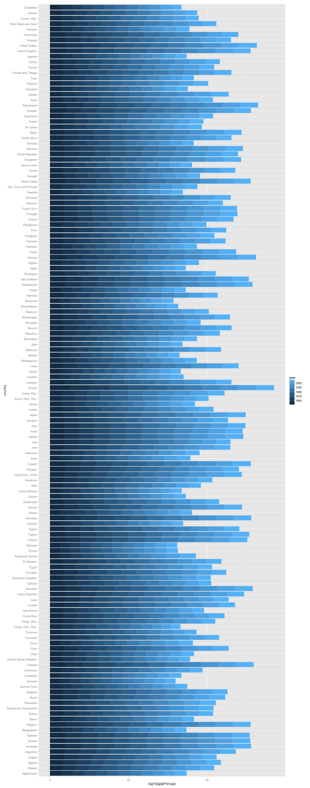
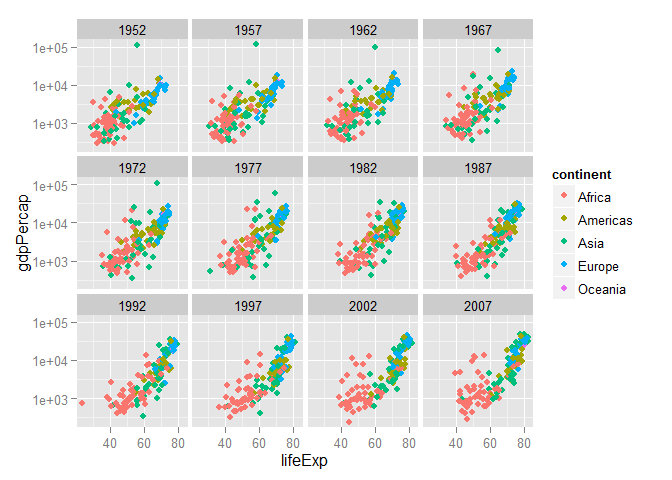
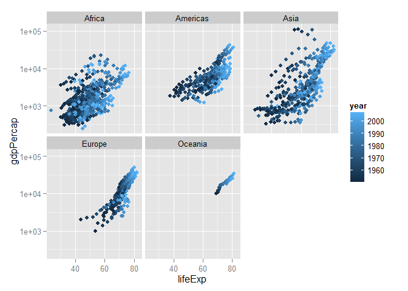
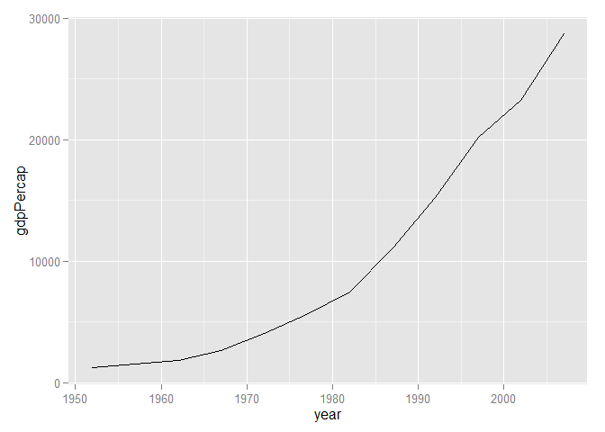

# Assignment 2
Qiong Zhang  
23 September, 2015  

# Data Import


I downloaded the data file into Homework2 folder. In order to read the data in a more convenient way, set the work path to Homework2 folder


```r
#setwd("Assignment/Homework2")
```

First, load the Gapminder data with both functions without specifying args other than file:

### Using *read.delim*

```r
gap1 <- read.delim("gapminderDataFiveYear.txt")
str(gap1)
```

```
## 'data.frame':	1704 obs. of  6 variables:
##  $ country  : Factor w/ 142 levels "Afghanistan",..: 1 1 1 1 1 1 1 1 1 1 ...
##  $ year     : int  1952 1957 1962 1967 1972 1977 1982 1987 1992 1997 ...
##  $ pop      : num  8425333 9240934 10267083 11537966 13079460 ...
##  $ continent: Factor w/ 5 levels "Africa","Americas",..: 3 3 3 3 3 3 3 3 3 3 ...
##  $ lifeExp  : num  28.8 30.3 32 34 36.1 ...
##  $ gdpPercap: num  779 821 853 836 740 ...
```
Without specifying args other than file using *read.delim* read the txt file seems okay. It creates a data.frame with 1704 obs. of 6 variables. We can know there is 1704 obs. by viewing document source of the data web page.

### Using *read.table* 
#### Wrong way

Without specifying args other than file using *read.table* can't read the data and doesn't work, the output says:


```r
gap2 <- read.table("gapminderDataFiveYear.txt")
```

```
## Error in scan(file, what, nmax, sep, dec, quote, skip, nlines, na.strings, : line 146 did not have 6 elements
```

```r
gap1[146,]
```

```
##                    country year     pop continent lifeExp gdpPercap
## 146 Bosnia and Herzegovina 1957 3076000    Europe   58.45  1353.989
```
__Summary__: 

When you look up the args of these two functions, you will find sep in read.table is "", and sep in read.delim is "\t", look at the 146th observation of the dataset, we can find out since there are some spaces in some countries names, thus it failes when read this data using read.table without specifying any argus.

#### A proper way

```r
gap<- read.table("gapminderDataFiveYear.txt",header = TRUE, sep = "\t",quote="")
```
__What we've changed:__

* As I have mentioned, there are some spaces in some countries names, set the sep value
* The variable names need to be seperate from the data, set header=T
* There are some countries have quoting probelm, set this one.

# Smell Test the Data

* Is it a data.frame, a matrix, a vector, a list?

```r
class(gap)
```

```
## [1] "data.frame"
```

* How many variables? How many rows/observations?

```r
dim(gap)
```

```
## [1] 1704    6
```

```r
nrow(gap);ncol(gap)
```

```
## [1] 1704
```

```
## [1] 6
```

* What flavor is each the variable?

```r
str(gap)
```

```
## 'data.frame':	1704 obs. of  6 variables:
##  $ country  : Factor w/ 142 levels "Afghanistan",..: 1 1 1 1 1 1 1 1 1 1 ...
##  $ year     : int  1952 1957 1962 1967 1972 1977 1982 1987 1992 1997 ...
##  $ pop      : num  8425333 9240934 10267083 11537966 13079460 ...
##  $ continent: Factor w/ 5 levels "Africa","Americas",..: 3 3 3 3 3 3 3 3 3 3 ...
##  $ lifeExp  : num  28.8 30.3 32 34 36.1 ...
##  $ gdpPercap: num  779 821 853 836 740 ...
```

__Summary__: It is a data.frame. 6 variables with pop, lifeExp and gdpPercap numerical, country and continent factor and year int.

# Explore individual variables
* How many observations each country have:


```r
table(gap$country)
```

```
## 
##              Afghanistan                  Albania                  Algeria 
##                       12                       12                       12 
##                   Angola                Argentina                Australia 
##                       12                       12                       12 
##                  Austria                  Bahrain               Bangladesh 
##                       12                       12                       12 
##                  Belgium                    Benin                  Bolivia 
##                       12                       12                       12 
##   Bosnia and Herzegovina                 Botswana                   Brazil 
##                       12                       12                       12 
##                 Bulgaria             Burkina Faso                  Burundi 
##                       12                       12                       12 
##                 Cambodia                 Cameroon                   Canada 
##                       12                       12                       12 
## Central African Republic                     Chad                    Chile 
##                       12                       12                       12 
##                    China                 Colombia                  Comoros 
##                       12                       12                       12 
##         Congo, Dem. Rep.              Congo, Rep.               Costa Rica 
##                       12                       12                       12 
##            Cote d'Ivoire                  Croatia                     Cuba 
##                       12                       12                       12 
##           Czech Republic                  Denmark                 Djibouti 
##                       12                       12                       12 
##       Dominican Republic                  Ecuador                    Egypt 
##                       12                       12                       12 
##              El Salvador        Equatorial Guinea                  Eritrea 
##                       12                       12                       12 
##                 Ethiopia                  Finland                   France 
##                       12                       12                       12 
##                    Gabon                   Gambia                  Germany 
##                       12                       12                       12 
##                    Ghana                   Greece                Guatemala 
##                       12                       12                       12 
##                   Guinea            Guinea-Bissau                    Haiti 
##                       12                       12                       12 
##                 Honduras         Hong Kong, China                  Hungary 
##                       12                       12                       12 
##                  Iceland                    India                Indonesia 
##                       12                       12                       12 
##                     Iran                     Iraq                  Ireland 
##                       12                       12                       12 
##                   Israel                    Italy                  Jamaica 
##                       12                       12                       12 
##                    Japan                   Jordan                    Kenya 
##                       12                       12                       12 
##         Korea, Dem. Rep.              Korea, Rep.                   Kuwait 
##                       12                       12                       12 
##                  Lebanon                  Lesotho                  Liberia 
##                       12                       12                       12 
##                    Libya               Madagascar                   Malawi 
##                       12                       12                       12 
##                 Malaysia                     Mali               Mauritania 
##                       12                       12                       12 
##                Mauritius                   Mexico                 Mongolia 
##                       12                       12                       12 
##               Montenegro                  Morocco               Mozambique 
##                       12                       12                       12 
##                  Myanmar                  Namibia                    Nepal 
##                       12                       12                       12 
##              Netherlands              New Zealand                Nicaragua 
##                       12                       12                       12 
##                    Niger                  Nigeria                   Norway 
##                       12                       12                       12 
##                     Oman                 Pakistan                   Panama 
##                       12                       12                       12 
##                 Paraguay                     Peru              Philippines 
##                       12                       12                       12 
##                   Poland                 Portugal              Puerto Rico 
##                       12                       12                       12 
##                  Reunion                  Romania                   Rwanda 
##                       12                       12                       12 
##    Sao Tome and Principe             Saudi Arabia                  Senegal 
##                       12                       12                       12 
##                   Serbia             Sierra Leone                Singapore 
##                       12                       12                       12 
##          Slovak Republic                 Slovenia                  Somalia 
##                       12                       12                       12 
##             South Africa                    Spain                Sri Lanka 
##                       12                       12                       12 
##                    Sudan                Swaziland                   Sweden 
##                       12                       12                       12 
##              Switzerland                    Syria                   Taiwan 
##                       12                       12                       12 
##                 Tanzania                 Thailand                     Togo 
##                       12                       12                       12 
##      Trinidad and Tobago                  Tunisia                   Turkey 
##                       12                       12                       12 
##                   Uganda           United Kingdom            United States 
##                       12                       12                       12 
##                  Uruguay                Venezuela                  Vietnam 
##                       12                       12                       12 
##       West Bank and Gaza              Yemen, Rep.                   Zambia 
##                       12                       12                       12 
##                 Zimbabwe 
##                       12
```
Function table shows us we have 142 countries each have 12 observations.

* Data Summary

```r
summary(gap$gdpPercap)
```

```
##     Min.  1st Qu.   Median     Mean  3rd Qu.     Max. 
##    241.2   1202.0   3532.0   7215.0   9325.0 113500.0
```

```r
summary(gap$lifeExp)
```

```
##    Min. 1st Qu.  Median    Mean 3rd Qu.    Max. 
##   23.60   48.20   60.71   59.47   70.85   82.60
```
The gdpPercap for these countries throughout the 12 years are between [241.2,113500], lifeExp are between[23.6,82.6]. There's a very big gdpPercap data. 

* This is a bar plot of gdpPercap for each country each year, it can show you the increase of each coutry's gapPercap as well as the final gdpPercap.


```r
library(ggplot2)
#ggplot(gap, aes(x=country, y=log10(gdpPercap)))+ geom_bar(stat="identity") +facet_wrap(~ year)+ coord_flip()
ggplot(gap, aes(x=country, y=log10(gdpPercap),fill=year))+ geom_bar(stat="identity") + coord_flip()
```

 

* This is a scatter plot of lifeEXp_log10(gdpPercap), it really can show something interesting. I draw a scatterplot for each year and colored the scatter plot according to their continent, We can see clearly from the picture it seems has some cluster depends on the continent. Overall, countries in africa have lower lifeExp& gdpPercap, countries in Europe have higher lifeExp& gdpPercap. With time past, the average of lifeExp increases since the plot shifts to the right.


```r
ggplot(gap, aes(x = lifeExp, y = gdpPercap)) +
  geom_point(aes(color=continent))+ facet_wrap(~ year)+scale_y_log10() 
```

 

* I've investigated the relationship between lifeExp and gdpPercap each year, let's see how it changes during these years in each continent. We can clearly see from this plot, generally speaking, every continent's lifeExp & gdpPercap increase as time went by.


```r
ggplot(gap, aes(x = lifeExp, y = gdpPercap)) +
  geom_point(aes(color=year))+ facet_wrap(~ continent)+scale_y_log10() 
```

 


* I randomly chose 1 country out of 142 and see how there gdpPercap changes. You can use this method to investigate the changes of each countries' gdpPercap change.

```r
set.seed(43256)
a <- sample(1:142,1)
randomdata <- gap[((a-1)*12+1):(a*12),]
ggplot(randomdata, aes(x=year, y=gdpPercap))+ geom_line() 
```

 

###Something useful
When I draw the bar plot grouped by countries, since there are 142 countries you can't clearly see the label of the courties. At first, I intended to set the size of the picture in ggplot, but I failed. Finally there's a way: we can set the width in the chunk like this:
```
{r fig.width=7, fig.height=4, echo=FALSE}
```
