# Assignment3
Qiong Zhang  
2015年10月3日  


#Preparation

```r
library(dplyr)
```

```
## 
## Attaching package: 'dplyr'
## 
## The following objects are masked from 'package:stats':
## 
##     filter, lag
## 
## The following objects are masked from 'package:base':
## 
##     intersect, setdiff, setequal, union
```

```r
library(ggplot2)
library(knitr)
#setwd("Assignment/Homework3")
gapminder<- read.table("gapminderDataFiveYear.txt",header = TRUE, sep = "\t",quote="")
library(reshape2)
```

#Task menu

* __Get the maximum and minimum of GDP per capita for all continents.__

```r
knitr::kable(gapminder %>% group_by(continent) %>%  summarize(min_of_GDP_per_capita = min(gdpPercap), max_of_GDP_per_capita = max(gdpPercap)),format="markdown")
```


|continent | min_of_GDP_per_capita| max_of_GDP_per_capita|
|:---------|---------------------:|---------------------:|
|Africa    |              241.1659|              21951.21|
|Americas  |             1201.6372|              42951.65|
|Asia      |              331.0000|             113523.13|
|Europe    |              973.5332|              49357.19|
|Oceania   |            10039.5956|              34435.37|


```r
ggplot(gapminder, aes(x = continent, y = gdpPercap)) +
  scale_y_log10() + stat_summary(fun.y = min, aes(colour="Min"), geom = "point", size = 3) +
  stat_summary(fun.y = max, aes(colour="Max"), geom = "point", size = 3)+ scale_colour_manual(name="",values=c("green","red"),breaks=c("Max", "Min"), labels=c("Max_GDP", "Min_GDP"))+stat_summary(aes(label=round(..y..,2)), fun.y=min,geom="text", size=3, hjust = -0.3)+stat_summary(aes(label=round(..y..,1)), fun.y=max,geom="text", size=3, hjust = -0.3)+labs(title="Min and Max GDP per capita by continent")
```

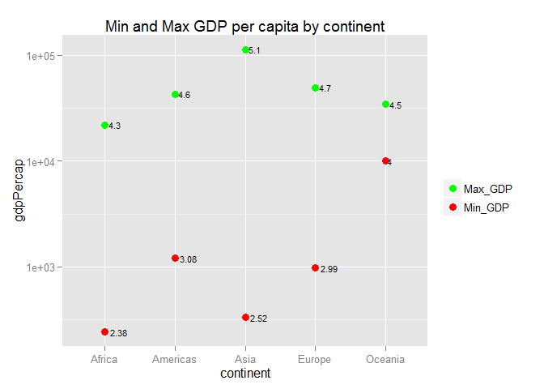 

* summary:

     + `group_by()` adds extra structure to dataset – grouping information – which lays the groundwork for computations within the groups. Since I want to get the min and max of GDP per capita within each continent, grouping information is needed.

     + `summarize()` takes a dataset with n observations, computes requested summaries, and returns a dataset with 1 observation. I have  a lot of observations of GDP per capita, and I want to get the min and max, I need a function returns only 1 observation, so I use `summarize()`, what's more I can use function `min` and `max` to help me get the min and max value of GDP per capita.
     
     + The results show that a country in Asia has the highest GDP per capita, while countries in Africa have the lowest which as we expected.
     
     + Adding a legend in this graph is hard, please see the first one in something useful part if you're interested in it!

* __Look at the spread of GDP per capita within the continents.__

```r
knitr::kable(gapminder %>% group_by(continent) %>% summarise(IQR = IQR(gdpPercap), sd = sd(gdpPercap), min = min(gdpPercap), median = median(gdpPercap), max = max(gdpPercap)),format = "markdown")
```


|continent |       IQR|        sd|        min|    median|       max|
|:---------|---------:|---------:|----------:|---------:|---------:|
|Africa    |  1616.170|  2827.930|   241.1659|  1192.138|  21951.21|
|Americas  |  4402.431|  6396.764|  1201.6372|  5465.510|  42951.65|
|Asia      |  7492.262| 14045.373|   331.0000|  2646.787| 113523.13|
|Europe    | 13248.301|  9355.213|   973.5332| 12081.749|  49357.19|
|Oceania   |  8072.258|  6358.983| 10039.5956| 17983.304|  34435.37|

```r
ggplot(gapminder, aes(x = continent, y = gdpPercap,color=continent)) +geom_boxplot()+stat_summary(fun.y = min, colour = "red", geom = "point", size = 3)+stat_summary(fun.y = max, colour = "green", geom = "point", size = 3)+scale_y_log10()+labs(title="Side-by-side boxplot for GDP per capita")
```

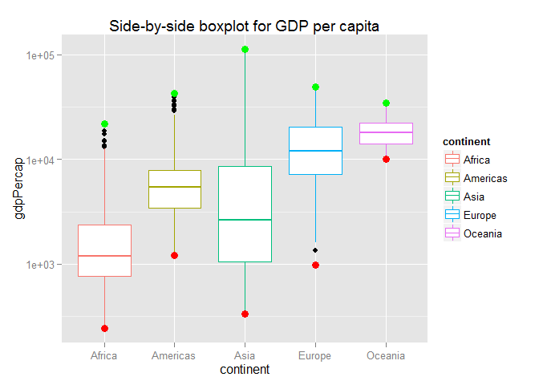 

* summary:

     + Just as the first one, we use `group_by()` and `summarize()` here, in `summarize()`, we use IQR and SD which are used to measure the spread of data.
     
     + The results show that gdpPercap in Asia have large variance, while gdpPercap in Africa have the lowest variance. What's more, Within each continent, there's a large difference between IQR and SD, so the distribution of GDP per capita might not be symmetric.
     
     + I add min and max onto the side-by-side boxplot.
     
* __Compute a trimmed mean of life expectancy for different years. Or a weighted mean, weighting by population. Just try something other than the plain vanilla mean.__


```r
knitr::kable(gapminder %>% select(year, lifeExp, pop) %>% group_by(year) %>% summarise(weighted_avg=weighted.mean(lifeExp,pop)),format="markdown")
```


| year| weighted_avg|
|----:|------------:|
| 1952|     48.94424|
| 1957|     52.12189|
| 1962|     52.32438|
| 1967|     56.98431|
| 1972|     59.51478|
| 1977|     61.23726|
| 1982|     62.88176|
| 1987|     64.41635|
| 1992|     65.64590|
| 1997|     66.84934|
| 2002|     67.83904|
| 2007|     68.91909|


```r
gapminder %>% select(year, lifeExp, pop) %>% group_by(year) %>% summarise(weighted_avg=weighted.mean(lifeExp,pop)) %>% ggplot(aes(x=year,y=weighted_avg))+geom_line()+geom_point()+labs(title = "Lineplot for trimmed mean of life Expectancy for different years")
```

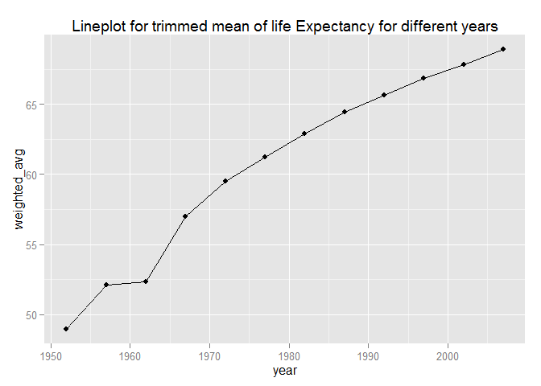 

* summary:

     + I use `weighted.mean()` which offers another function that we use in `summarise()` in `dplyr`
     
     + The result of the plot is as we expected, the trimmed mean increases as time changing over.
     
This gives me a thought of calculating trimmed mean within each continent for different years. Also weigted by population.


```r
knitr::kable(gapminder %>% select(year, continent, lifeExp, pop) %>% group_by(year,continent) %>% summarise(weighted_avg=weighted.mean(lifeExp,pop)),format="markdown")
```


| year|continent | weighted_avg|
|----:|:---------|------------:|
| 1952|Africa    |     38.79973|
| 1952|Americas  |     60.23599|
| 1952|Asia      |     42.94114|
| 1952|Europe    |     64.90540|
| 1952|Oceania   |     69.17040|
| 1957|Africa    |     40.94031|
| 1957|Americas  |     62.01806|
| 1957|Asia      |     47.28835|
| 1957|Europe    |     66.89364|
| 1957|Oceania   |     70.31693|
| 1962|Africa    |     43.09925|
| 1962|Americas  |     63.43706|
| 1962|Asia      |     46.57369|
| 1962|Europe    |     68.45957|
| 1962|Oceania   |     70.98808|
| 1967|Africa    |     45.17721|
| 1967|Americas  |     64.50630|
| 1967|Asia      |     53.88261|
| 1967|Europe    |     69.54963|
| 1967|Oceania   |     71.17848|
| 1972|Africa    |     47.21229|
| 1972|Americas  |     65.70490|
| 1972|Asia      |     57.52159|
| 1972|Europe    |     70.46884|
| 1972|Oceania   |     71.92273|
| 1977|Africa    |     49.20883|
| 1977|Americas  |     67.60591|
| 1977|Asia      |     59.55648|
| 1977|Europe    |     71.53989|
| 1977|Oceania   |     73.25684|
| 1982|Africa    |     51.01744|
| 1982|Americas  |     69.19264|
| 1982|Asia      |     61.57472|
| 1982|Europe    |     72.56247|
| 1982|Oceania   |     74.58291|
| 1987|Africa    |     52.82479|
| 1987|Americas  |     70.35814|
| 1987|Asia      |     63.53710|
| 1987|Europe    |     73.44717|
| 1987|Oceania   |     75.98107|
| 1992|Africa    |     53.37292|
| 1992|Americas  |     71.72177|
| 1992|Asia      |     65.14874|
| 1992|Europe    |     74.44273|
| 1992|Oceania   |     77.35788|
| 1997|Africa    |     53.28327|
| 1997|Americas  |     73.19154|
| 1997|Asia      |     66.77092|
| 1997|Europe    |     75.70849|
| 1997|Oceania   |     78.61843|
| 2002|Africa    |     53.30314|
| 2002|Americas  |     74.24736|
| 2002|Asia      |     68.13732|
| 2002|Europe    |     77.02232|
| 2002|Oceania   |     80.16006|
| 2007|Africa    |     54.56441|
| 2007|Americas  |     75.35668|
| 2007|Asia      |     69.44386|
| 2007|Europe    |     77.89057|
| 2007|Oceania   |     81.06215|

After learning the package `tidyr`, I can make the table more beautiful.

```r
library(tidyr)
a <- gapminder %>% select(year, continent, lifeExp, pop) %>% group_by(year,continent) %>% summarise(weighted_avg=weighted.mean(lifeExp,pop))
knitr::kable(spread(a, year, weighted_avg),format="markdown")
```


|continent |     1952|     1957|     1962|     1967|     1972|     1977|     1982|     1987|     1992|     1997|     2002|     2007|
|:---------|--------:|--------:|--------:|--------:|--------:|--------:|--------:|--------:|--------:|--------:|--------:|--------:|
|Africa    | 38.79973| 40.94031| 43.09925| 45.17721| 47.21229| 49.20883| 51.01744| 52.82479| 53.37292| 53.28327| 53.30314| 54.56441|
|Americas  | 60.23599| 62.01806| 63.43706| 64.50630| 65.70490| 67.60591| 69.19264| 70.35814| 71.72177| 73.19154| 74.24736| 75.35668|
|Asia      | 42.94114| 47.28835| 46.57369| 53.88261| 57.52159| 59.55648| 61.57472| 63.53710| 65.14874| 66.77092| 68.13732| 69.44386|
|Europe    | 64.90540| 66.89364| 68.45957| 69.54963| 70.46884| 71.53989| 72.56247| 73.44717| 74.44273| 75.70849| 77.02232| 77.89057|
|Oceania   | 69.17040| 70.31693| 70.98808| 71.17848| 71.92273| 73.25684| 74.58291| 75.98107| 77.35788| 78.61843| 80.16006| 81.06215|


```r
gapminder %>% select(year, continent, lifeExp, pop) %>% group_by(year,continent) %>% summarise(weighted_avg=weighted.mean(lifeExp,pop)) %>% ggplot(aes(x=year,y=weighted_avg,color=continent))+geom_point()+geom_line()+labs(title = "Trimmed mean of life Expectancy for different years within each continent")
```

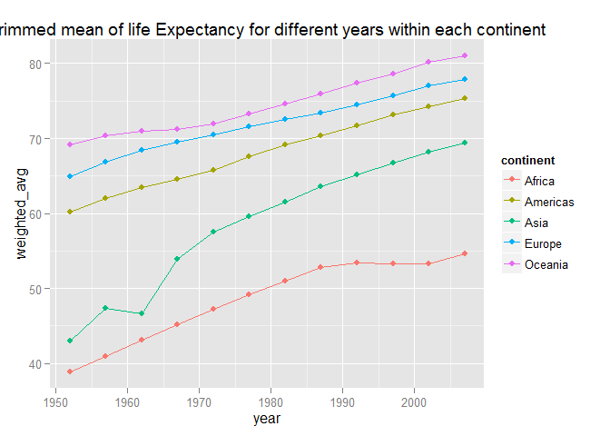 

__Something Interesting__: We can see from the two plots above, it seems like the trimmed mean plot for asia looks like the trimmed mean plot for the whole world, maybe because asia has a large number of population?

* __How is life expectancy changing over time on different continents?__


```r
gapminder %>% arrange(continent,year) %>% select(continent, year, lifeExp) %>% glimpse()
```

```
## Observations: 1,704
## Variables: 3
## $ continent (fctr) Africa, Africa, Africa, Africa, Africa, Africa, Afr...
## $ year      (int) 1952, 1952, 1952, 1952, 1952, 1952, 1952, 1952, 1952...
## $ lifeExp   (dbl) 43.077, 30.015, 38.223, 47.622, 31.975, 39.031, 38.5...
```

```r
gapminder %>% ggplot(aes(x=factor(year),y=lifeExp))+geom_violin(colour="pink")+facet_wrap(~continent)
```

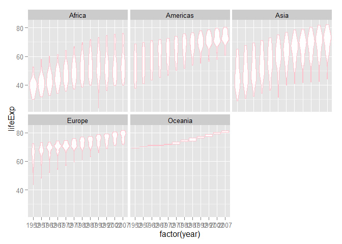 

* summary:

     + The graph shows that there's outlier.
     
     + The result of the barplot is as we expected, the trimmed mean increases as time changing over.
     
     + The plot looks not very nice since there's too many countries in each continent and the number of countries are not equal, thus I draw another one using mean of life expectancy within each continent to make the measure more uniform.


```r
gapminder %>% group_by(continent,year) %>% summarise(mean=mean(lifeExp)) 
```

```
## Source: local data frame [60 x 3]
## Groups: continent [?]
## 
##    continent  year     mean
##       (fctr) (int)    (dbl)
## 1     Africa  1952 39.13550
## 2     Africa  1957 41.26635
## 3     Africa  1962 43.31944
## 4     Africa  1967 45.33454
## 5     Africa  1972 47.45094
## 6     Africa  1977 49.58042
## 7     Africa  1982 51.59287
## 8     Africa  1987 53.34479
## 9     Africa  1992 53.62958
## 10    Africa  1997 53.59827
## ..       ...   ...      ...
```

```r
gapminder %>% group_by(continent,year) %>% summarise(mean=mean(lifeExp)) %>% ggplot(aes(x=year,y=mean,color=continent))+geom_point()+geom_line()
```

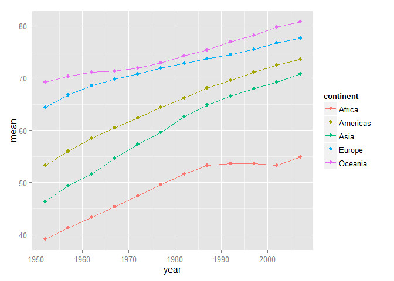 

* __Report the absolute and/or relative abundance of countries with low life expectancy over time by continent: Compute some measure of worldwide life expectancy – you decide – a mean or median or some other quantile or perhaps your current age. The determine how many countries on each continent have a life expectancy less than this benchmark, for each year.__


```r
knitr::kable(gapminder %>% mutate(measure=rep(mean(lifeExp),length(lifeExp))) %>% group_by(continent,year) %>% filter(lifeExp<measure) %>% summarise(n_distinct(country)),format = "markdown")
```


|continent | year| n_distinct(country)|
|:---------|----:|-------------------:|
|Africa    | 1952|                  52|
|Africa    | 1957|                  52|
|Africa    | 1962|                  51|
|Africa    | 1967|                  50|
|Africa    | 1972|                  50|
|Africa    | 1977|                  49|
|Africa    | 1982|                  43|
|Africa    | 1987|                  39|
|Africa    | 1992|                  38|
|Africa    | 1997|                  39|
|Africa    | 2002|                  41|
|Africa    | 2007|                  40|
|Americas  | 1952|                  19|
|Americas  | 1957|                  15|
|Americas  | 1962|                  13|
|Americas  | 1967|                  10|
|Americas  | 1972|                   8|
|Americas  | 1977|                   7|
|Americas  | 1982|                   5|
|Americas  | 1987|                   2|
|Americas  | 1992|                   1|
|Americas  | 1997|                   1|
|Americas  | 2002|                   1|
|Asia      | 1952|                  29|
|Asia      | 1957|                  26|
|Asia      | 1962|                  25|
|Asia      | 1967|                  23|
|Asia      | 1972|                  19|
|Asia      | 1977|                  14|
|Asia      | 1982|                  11|
|Asia      | 1987|                   8|
|Asia      | 1992|                   7|
|Asia      | 1997|                   6|
|Asia      | 2002|                   3|
|Asia      | 2007|                   1|
|Europe    | 1952|                   5|
|Europe    | 1957|                   3|
|Europe    | 1962|                   1|
|Europe    | 1967|                   1|
|Europe    | 1972|                   1|


```r
gapminder %>% mutate(measure=rep(mean(lifeExp),length(lifeExp))) %>% group_by(continent,year) %>% filter(lifeExp<measure) %>% summarise(n=n_distinct(country)) %>%  arrange(n)%>% ggplot(aes(x=year,y=n,fill=continent))+geom_bar(stat="identity",position="dodge")
```

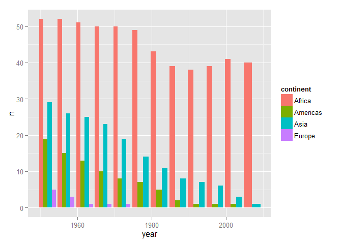 

* summary:

     + First, I add another variable which is the measure of worldwide life expectancy. Then, as we need the number of distinct countries on each continent which have a life expectancy less than the worldwide measure, we need to group by continent and year.
     
     + I set the mean of all the observations of lifeExp as a worldwide measure.
     
     + The graph show us: First, there's no country's life expectancy in oceania less than worldwide measure, which means the countries in the continent have a high level of life expectancy. Second, the number of countries we intened to compute in each countinent except for Africa decreses as time changing over, which means life expectancy increases all the time in all countries as we expected. The number of countries in Africa varies as time changing, the phenomenon need us pay attention and investige why would this happen.
     
     + Africa has the largest number of countries, asia after and then Americas and Europe. Just as we expected, lifeExp is related to the development or condition of economy. Generally speaking, the better economy, the longer life expectancy.

* __Find countries with interesting stories. Open-ended and, therefore, hard. Promising but unsuccessful attempts are encouraged. This will generate interesting questions to follow up on in class.__

I'm from China and I want to learn more about China's population and GDP,

```r
only_china <- gapminder %>% filter(country=="China")
ggplot(only_china,aes(x=gdpPercap,y=lifeExp))+geom_point()+geom_line()+scale_x_log10()+scale_y_log10()
```

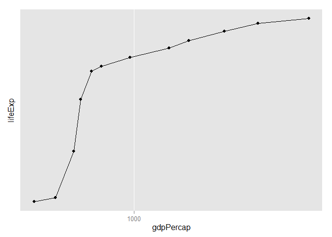 

```r
ggplot(only_china,aes(x=year,y=lifeExp))+geom_point()+geom_line()
```

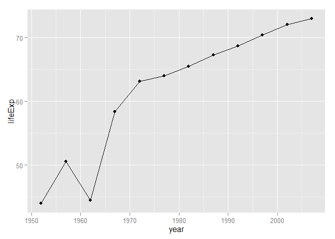 

```r
ggplot(only_china,aes(x=year,y=gdpPercap))+geom_point()+geom_line()
```

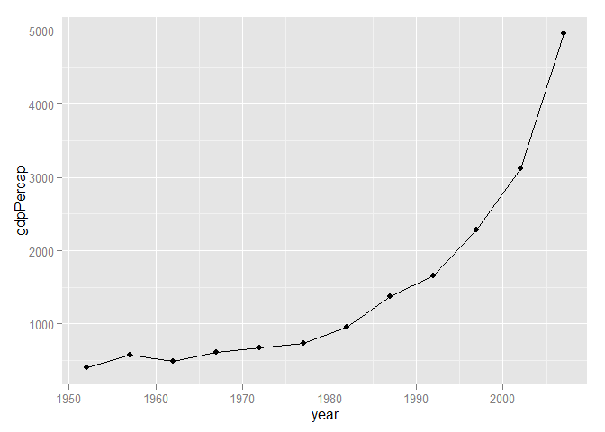 

* summary:

      + As we can see, there's a decrease in China's population around 1962. It's so funny to read something from the graph. That's because of the Great Chinese Famine of 1960 which killed a lot of people.
      
      + GDP per capita in China is higher than 1000 after year 1982 and increases in a high speed owing to the reform and opening-up policy in China since 1979. 
      
      + Since China's economy develops quite fast since 1982, I want to make a horizontal comparison with some other countries.
      
      

```r
gapminder %>% filter(year>1979,country %in% c("China","America","Canada","Japan","United Kingdom","Australia")) %>% select(country,year,gdpPercap) %>% arrange(year)
```

```
##           country year  gdpPercap
## 1       Australia 1982 19477.0093
## 2          Canada 1982 22898.7921
## 3           China 1982   962.4214
## 4           Japan 1982 19384.1057
## 5  United Kingdom 1982 18232.4245
## 6       Australia 1987 21888.8890
## 7          Canada 1987 26626.5150
## 8           China 1987  1378.9040
## 9           Japan 1987 22375.9419
## 10 United Kingdom 1987 21664.7877
## 11      Australia 1992 23424.7668
## 12         Canada 1992 26342.8843
## 13          China 1992  1655.7842
## 14          Japan 1992 26824.8951
## 15 United Kingdom 1992 22705.0925
## 16      Australia 1997 26997.9366
## 17         Canada 1997 28954.9259
## 18          China 1997  2289.2341
## 19          Japan 1997 28816.5850
## 20 United Kingdom 1997 26074.5314
## 21      Australia 2002 30687.7547
## 22         Canada 2002 33328.9651
## 23          China 2002  3119.2809
## 24          Japan 2002 28604.5919
## 25 United Kingdom 2002 29478.9992
## 26      Australia 2007 34435.3674
## 27         Canada 2007 36319.2350
## 28          China 2007  4959.1149
## 29          Japan 2007 31656.0681
## 30 United Kingdom 2007 33203.2613
```

```r
gapminder %>% filter(year>1979,country %in% c("China","America","Canada","Japan","United Kingdom","Australia")) %>% select(country,year,gdpPercap) %>% arrange(year) %>% ggplot(aes(year,gdpPercap,fill=country))+geom_bar(stat="identity",position="dodge")
```

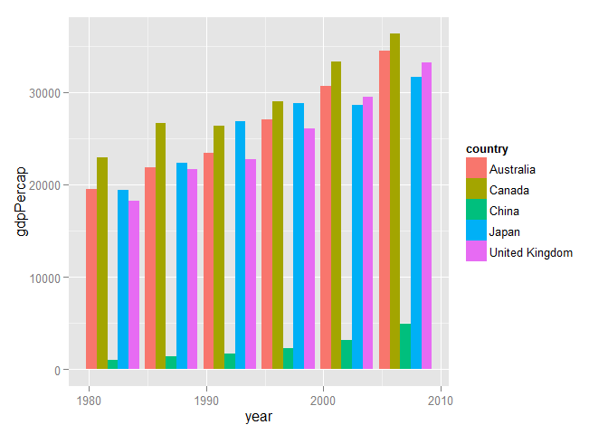 

The graph is so amazing, it seems like China's GDP grows very fast, when compared with other large countries, still too low.

#Something useful and thoughts
* Here's a useful link I used for the first graph on [How to add legend manually in ggplot?](http://stackoverflow.com/questions/10349206/add-legend-to-ggplot2-line-plot)

* Another [Creating elegant HTML presentations that feature R code (using slidify )](http://zevross.com/blog/2014/11/19/creating-elegant-html-presentations-that-feature-r-code/)

* The tables look ugly and may learn more about it.
