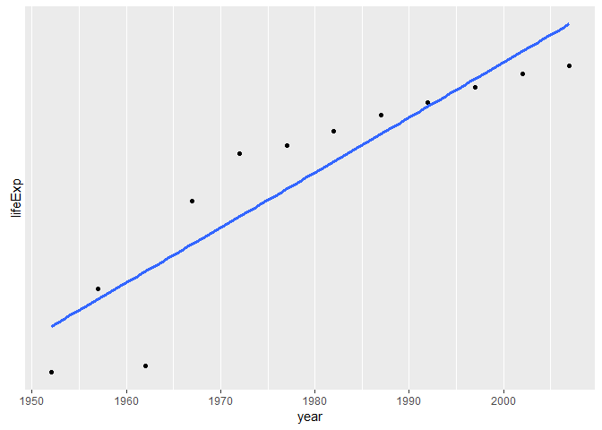
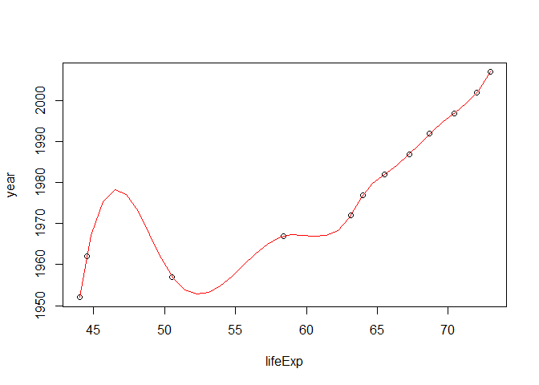
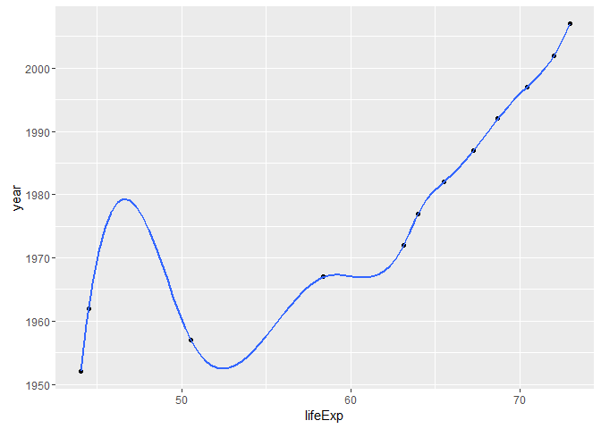
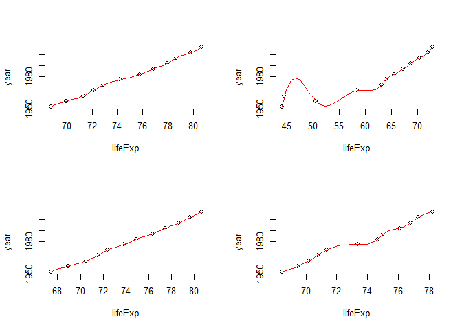
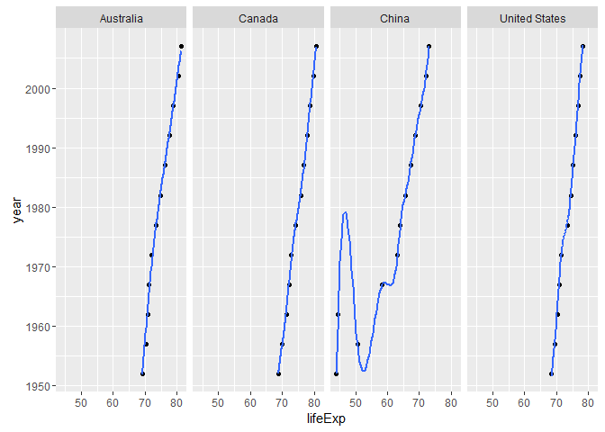
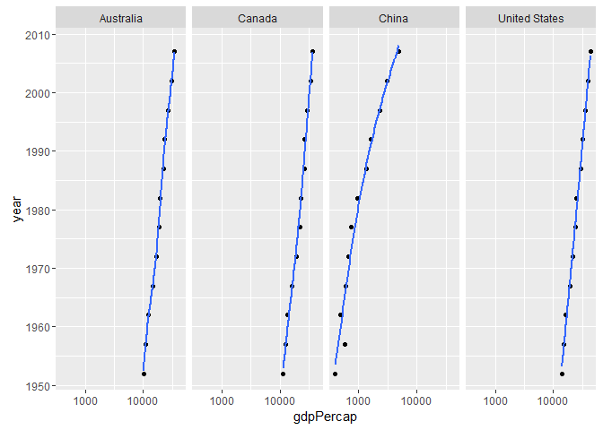
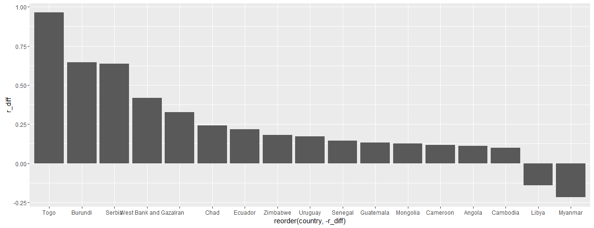

# Assignment 4
Qiong Zhang  
2015年10月14日  


# Preparation

As usual, load the `Gapminder` excerpt. Load `ggplot2` to visualizate the result. Load `dplyr` to do something useful to pieces of Gapminder data. Load `broom` to try to tidy the result. Remember to load `plyr` first if you're using `dplyr` and `plyr` together.


```r
library(gapminder)
library(ggplot2)
library(plyr)
suppressPackageStartupMessages(library(dplyr))
library(broom)
```

# Tasks

##Task 1 - Warm up

### Filter Data 

We first start from a very simple exploration of China's interesting story.

```r
only_china <- gapminder %>% filter(country=="China")
```


### Visualize and Improvement
As we've learned in class, always, always plot the data first.


```r
ggplot(only_china,aes(x=year,y=lifeExp))+geom_point()+geom_smooth(lwd = 1.3, se = FALSE, method = "lm")+scale_y_log10()
```

 

It seems like linear regression is not effective for China's lifeExp increasing. Thus, I'll use what I've learned in statistical class - interpolating cubic spline, which minimize the curvature may be very useful in this case. I'll create a function use graph in R base. I'll do some change to it later.

__Creat the Super easy function__:

```r
cubic_fit <- function(data){
    the_fit <- spline(data$year~data$lifeExp)
    plot(data$lifeExp,data$year,xlab="lifeExp" ,ylab="year")
    lines(the_fit, col="red")
    t <- setNames(data.frame(the_fit), c("x", "y"))
}
```

### Test the Function

```r
cubic_fit(only_china)
```

 


* The spline seems much smoother and looks more reasonable since those observations are speaking for themselves.

* It is super-easy for us to visualize the plot in base R, but I find it hard for us to plot the graph with ggplot2. After consulting the [website](http://www.lgbmi.com/2011/10/using-smooth-spline-in-stat-scale-in-ggplot2/), I used his work and make the goal to visualize the plot with ggplot2 which looks much better.

* Cubic spline is local smooth, so we can't use polynomial regression instead.

### A manual smooth function can be used in `geom_smooth`

```r
smooth.spline2 <- function(formula, data,...) { 
  mat <- model.frame(formula, data) 
  smooth.spline(mat[, 2], mat[, 1]) 
} 

predictdf.smooth.spline <- function(model, xseq, se, level) { 
  pred <- predict(model, xseq) 
  data.frame(x = xseq, y = pred$y) 
} 
```


```r
qplot(lifeExp, year, data = only_china) + geom_smooth(method = "smooth.spline2", se= F)
```

 

### To test if both of my function works for multiple countries

__cubic_fit function :__
In order to draw several pictures, I first use `par` to make plotting mulpitle plots come true.

```r
par(mfrow=c(2,2))
gapminder %>% filter(country %in% c("China", "France", "United States", "Canada"))%>% group_by(country) %>% do(cubic_fit(.))
```

 

```
## Source: local data frame [144 x 3]
## Groups: country [4]
## 
##    country        x        y
##     (fctr)    (dbl)    (dbl)
## 1   Canada 68.75000 1952.000
## 2   Canada 69.09009 1953.705
## 3   Canada 69.43017 1955.131
## 4   Canada 69.77026 1956.364
## 5   Canada 70.11034 1957.490
## 6   Canada 70.45043 1958.601
## 7   Canada 70.79051 1959.802
## 8   Canada 71.13060 1961.199
## 9   Canada 71.47069 1962.892
## 10  Canada 71.81077 1964.897
## ..     ...      ...      ...
```


__manual cubic spline in ggplot2 :__

```r
d <- gapminder %>% filter(country %in% c("United States","China","Canada","Australia"))

qplot(lifeExp, year, data = d) + geom_smooth(method = "smooth.spline2", se= F)+facet_grid(~country)
```

 

```r
qplot(gdpPercap, year, data = d) + geom_smooth(method = "smooth.spline2", se= F)+facet_grid(~country)+scale_x_log10()
```

 

The function works quite well for different variables and data set.

##Task 2 - linear regression

> Fit a regression of the response vs. time. Use the residuals to detect countries where your model is a terrible fit.

With the suggestion of Mary, I'll use boxplot of residual to find out the outlier residual.

### Write the Function

```r
resid_outlier <- function(data, offset = 1952) {
  the_fit <- lm(lifeExp ~ I(year - offset), data)
  n <- length(the_fit$resid[the_fit$resid> max(the_fit$resid)+1.5*IQR(the_fit$resid)|the_fit$resid< min(the_fit$resid)-1.5*IQR(the_fit$resid)])
  n <- setNames(data.frame(t(n)), c("n_resid_outlier")) 
  n
}
```


###Test the Function


```r
resid_country <- ddply(gapminder, ~ country, resid_outlier)
resid_country %>% filter(n_resid_outlier>0)
```

```
## [1] country         n_resid_outlier
## <0 rows> (or 0-length row.names)
```

There's no country in the model above have terrible residual.

##Task 3 - OLS v.s. robust

> Fit a regression using ordinary least squares and a robust technique. Determine the difference in estimated parameters under the two approaches. If it is large, consider that country “interesting”. 

In a linear regreesion model, the closer adjusted r sqaure value to 1, the better the model fitted. The comparison between intercept can not tell us many information. Thus, we'll focus on the difference between adjusted r square. The gdpPercap is super large, thus we use log(gdpPercap) as the response variable in linear model. There's no adjusted R square in function rlm, so we use function lmrob instead.

###Write the Function

```r
library(robustbase)
```


```r
LM_diff <- function(data, offset = 1952) {
  OLS_fit <- lm(log(gdpPercap) ~ I(year - offset), data) #least square model
  robust_fit <- lmrob(log(gdpPercap) ~ I(year - offset), data, method="MM") #robust regression
  diff <- summary(robust_fit)$adj.r - summary(OLS_fit)$adj.r
  diff <- setNames(data.frame(t(diff)), c("r_diff")) 
  diff
}
```

###Test the Function

I'll test the function on only_china data and the whole data grouped by country. And if the absolute different between the two adjusted r squres is larger than 0.1, than I'll visualize those countries in the next step.


```r
LM_diff(gapminder %>% filter(country=="China"))
```

```
##         r_diff
## 1 -0.008831613
```


```r
knitr::kable(head( gapminder %>% group_by(country) %>% do(LM_diff(.))),format = 'markdown')
```


|country     |     r_diff|
|:-----------|----------:|
|Afghanistan |  0.0056311|
|Albania     |  0.0468970|
|Algeria     | -0.0248606|
|Angola      |  0.1126525|
|Argentina   |  0.0233580|
|Australia   |  0.0004336|

###Visualize the Function

```r
t <- gapminder %>% group_by(country) %>% do(LM_diff(.)) %>% filter(abs(r_diff)>0.1)

ggplot(t, aes(x=reorder(country,-r_diff), y=r_diff))+geom_bar(stat="identity")
```

 

As we can see from the picture above, the countries' whose OLS model and robust regression model have large difference on adjust r square are those countries with not economically developed, so the GDP may vary and thus lead to the result we get here.   


## Task 4 - High leverage point in OLS regression of log(gdpPercap) ~ log(Pop)


###Statistical background  


The red line is the model with leverage, the blue one is the model without leverage. 

The leverage in regression means the obeservation's the x value is so large that may influence the slope of the model. Consider the diagnol elements of hat matrix, if we have the ith diagnol element of the matrix is larger than 2* mean of all the elements, than the ith observation is a high leverage. I'm going to start working on this problem.

### Write the function

```r
high_leverage <- function(data){
  stopifnot(is.data.frame(data))
  my_fit <- lm(log(gdpPercap)~log(pop), data)
  num <- sum(influence(my_fit)$hat>2*mean(influence(my_fit)$hat))
  num <- setNames(data.frame(t(num)), c("num_of_high_leverage")) 
  num
}
```
###Test the Function

```r
high_leverage(only_china)
```

```
##   num_of_high_leverage
## 1                    1
```
The result shows there's only 1 high leverage on China's data. I hope I can test on the whole data using functions in `dplyr`. Also use `broom` to tidy the result from `dplyr::do`.


```r
gapminder %>% group_by(country) %>% do(tidy(high_leverage(.)))
```

```
## Source: local data frame [142 x 14]
## Groups: country [142]
## 
##        country               column     n  mean    sd median trimmed   mad
##         (fctr)                (chr) (dbl) (dbl) (dbl)  (dbl)   (dbl) (dbl)
## 1  Afghanistan num_of_high_leverage     1     1    NA      1       1     0
## 2      Albania num_of_high_leverage     1     1    NA      1       1     0
## 3      Algeria num_of_high_leverage     1     0    NA      0       0     0
## 4       Angola num_of_high_leverage     1     0    NA      0       0     0
## 5    Argentina num_of_high_leverage     1     0    NA      0       0     0
## 6    Australia num_of_high_leverage     1     1    NA      1       1     0
## 7      Austria num_of_high_leverage     1     0    NA      0       0     0
## 8      Bahrain num_of_high_leverage     1     0    NA      0       0     0
## 9   Bangladesh num_of_high_leverage     1     0    NA      0       0     0
## 10     Belgium num_of_high_leverage     1     1    NA      1       1     0
## ..         ...                  ...   ...   ...   ...    ...     ...   ...
## Variables not shown: min (dbl), max (dbl), range (dbl), skew (dbl),
##   kurtosis (dbl), se (dbl)
```

Show the countries with leverage.


```r
ncountry <- gapminder %>% group_by(country) %>% do(high_leverage(.)) %>% filter(num_of_high_leverage>0)

knitr::kable(ncountry, format = "markdown")
```


|country                | num_of_high_leverage|
|:----------------------|--------------------:|
|Afghanistan            |                    1|
|Albania                |                    1|
|Australia              |                    1|
|Belgium                |                    1|
|Bosnia and Herzegovina |                    1|
|Brazil                 |                    1|
|Burkina Faso           |                    1|
|Burundi                |                    1|
|Canada                 |                    1|
|Chad                   |                    1|
|Chile                  |                    1|
|China                  |                    1|
|Colombia               |                    1|
|Costa Rica             |                    1|
|Croatia                |                    1|
|Cuba                   |                    1|
|Czech Republic         |                    1|
|Denmark                |                    1|
|Dominican Republic     |                    1|
|El Salvador            |                    1|
|Equatorial Guinea      |                    1|
|Finland                |                    1|
|France                 |                    1|
|Germany                |                    1|
|Greece                 |                    1|
|Guinea-Bissau          |                    1|
|Hong Kong, China       |                    1|
|Hungary                |                    1|
|Iceland                |                    1|
|Ireland                |                    1|
|Israel                 |                    1|
|Italy                  |                    1|
|Jamaica                |                    1|
|Japan                  |                    1|
|Korea, Dem. Rep.       |                    1|
|Korea, Rep.            |                    1|
|Kuwait                 |                    1|
|Lebanon                |                    1|
|Mauritania             |                    1|
|Mauritius              |                    1|
|Mexico                 |                    1|
|Montenegro             |                    1|
|Netherlands            |                    1|
|New Zealand            |                    1|
|Norway                 |                    1|
|Poland                 |                    1|
|Reunion                |                    1|
|Romania                |                    1|
|Sao Tome and Principe  |                    1|
|Serbia                 |                    1|
|Sierra Leone           |                    1|
|Singapore              |                    1|
|Slovak Republic        |                    1|
|Spain                  |                    1|
|Sri Lanka              |                    1|
|Sweden                 |                    1|
|Switzerland            |                    1|
|Taiwan                 |                    1|
|Thailand               |                    1|
|Trinidad and Tobago    |                    1|
|Turkey                 |                    1|
|United Kingdom         |                    1|
|United States          |                    1|
|Uruguay                |                    1|
|Venezuela              |                    1|
|West Bank and Gaza     |                    1|
|Yemen, Rep.            |                    1|
|Zimbabwe               |                    1|

###Improvement

As I showed above, those countries have only one high leverage point, if we write the function as following, I can get which observation is the high leverage point.


```r
high_leverage2 <- function(data){
  stopifnot(is.data.frame(data))
  my_fit <- lm(log(gdpPercap)~log(pop), data)
  obs <- which(influence(my_fit)$hat>2*mean(influence(my_fit)$hat))
  obs <- setNames(data.frame(t(obs)), c("observation")) 
  obs
}
```


```r
high_leverage2(only_china)
```

```
##   observation
## 1           1
```

#Thanks
Thanks for Annie, dean and jenny's help with my git problem. Thank you so much.


#Somthing Useful and Thoughts

* [Roll Your Own Stats and Geoms in ggplot2 (Part 1: Splines!)](http://www.r-bloggers.com/roll-your-own-stats-and-geoms-in-ggplot2-part-1-splines/)
This is a website for you to write some functions by yourself to use ggplot2. The function here is high-level and is hard for noivce.

* In my task, I think I can also calculate the correlation coefficient between two variables. If the absolute the value is much closer to 1, it shows they have some linear relationship, thus we can carry on a linear regression to see. If the correlation is much closer to 0, the scatterplot is more averagely distributed, maybe make no sense to carry on a linear regression.

