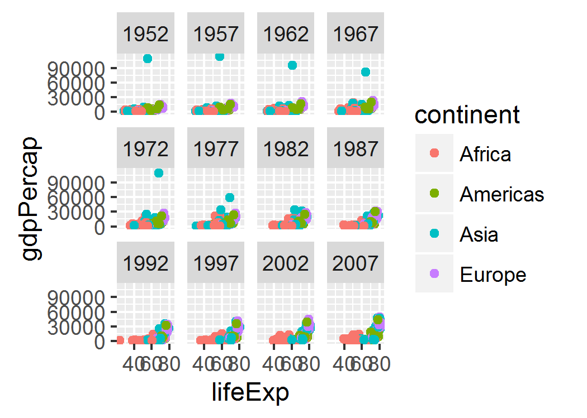

# Assignment 5
Qiong Zhang  
2015年10月14日  


##Preparation


```r
library(gapminder)
library(ggplot2)
library(dplyr)
```

```
## 
## Attaching package: 'dplyr'
## 
## The following objects are masked from 'package:stats':
## 
##     filter, lag
## 
## The following objects are masked from 'package:base':
## 
##     intersect, setdiff, setequal, union
```

```r
library(robustbase)
```


## Factor management

### Drop Oceania. 

Filter the Gapminder data to remove observations associated with the `continent` of Oceania. Additionally, Use `droplevels()` to remove unused factor levels. Provide concrete information on the data before and after removing these rows and Oceania; address the number of rows and the levels of the affected factors. Use a figure that includes a legend to further explore the effects of filtering data and/or changing factor levels.

__Filter__:
First have a look at the gapminder data before factor management

```r
str(gapminder)
```

```
## 'data.frame':	1704 obs. of  6 variables:
##  $ country  : Factor w/ 142 levels "Afghanistan",..: 1 1 1 1 1 1 1 1 1 1 ...
##  $ continent: Factor w/ 5 levels "Africa","Americas",..: 3 3 3 3 3 3 3 3 3 3 ...
##  $ year     : num  1952 1957 1962 1967 1972 ...
##  $ lifeExp  : num  28.8 30.3 32 34 36.1 ...
##  $ pop      : num  8425333 9240934 10267083 11537966 13079460 ...
##  $ gdpPercap: num  779 821 853 836 740 ...
```

```r
levels(gapminder$continent)
```

```
## [1] "Africa"   "Americas" "Asia"     "Europe"   "Oceania"
```
Continent is a factor and there's five levels named "Africa", "Americas", "Asia", "Europe", "Oceania", next remove observations associated with oceania.


```r
gapminder_filter <- gapminder %>% filter(continent!="Oceania")
str(gapminder_filter)
```

```
## 'data.frame':	1680 obs. of  6 variables:
##  $ country  : Factor w/ 142 levels "Afghanistan",..: 1 1 1 1 1 1 1 1 1 1 ...
##  $ continent: Factor w/ 5 levels "Africa","Americas",..: 3 3 3 3 3 3 3 3 3 3 ...
##  $ year     : num  1952 1957 1962 1967 1972 ...
##  $ lifeExp  : num  28.8 30.3 32 34 36.1 ...
##  $ pop      : num  8425333 9240934 10267083 11537966 13079460 ...
##  $ gdpPercap: num  779 821 853 836 740 ...
```

```r
levels(gapminder_filter$continent)
```

```
## [1] "Africa"   "Americas" "Asia"     "Europe"   "Oceania"
```
The number of observations decrease from 1704 to 1680, however, the levels don't change. Use the following funciton:


```r
gapminder_filter_drop <- gapminder_filter %>% droplevels()
str(gapminder_filter_drop)
```

```
## 'data.frame':	1680 obs. of  6 variables:
##  $ country  : Factor w/ 140 levels "Afghanistan",..: 1 1 1 1 1 1 1 1 1 1 ...
##  $ continent: Factor w/ 4 levels "Africa","Americas",..: 3 3 3 3 3 3 3 3 3 3 ...
##  $ year     : num  1952 1957 1962 1967 1972 ...
##  $ lifeExp  : num  28.8 30.3 32 34 36.1 ...
##  $ pop      : num  8425333 9240934 10267083 11537966 13079460 ...
##  $ gdpPercap: num  779 821 853 836 740 ...
```

```r
levels(gapminder_filter_drop$continent)
```

```
## [1] "Africa"   "Americas" "Asia"     "Europe"
```

__Figure__:


```r
gapminder_filter %>% 
  group_by(continent) %>% 
  summarize(n = n()) %>% 
  ggplot(aes(x = reorder(continent, n), y = n,color=continent)) + geom_point(size=3) + xlab("continent") + ggtitle("Country in each Continent")+ scale_color_discrete(drop = F)

gapminder_filter_drop %>% 
  group_by(continent) %>% 
  summarize(n = n()) %>% 
  ggplot(aes(x = reorder(continent, n), y = n, color = continent)) + geom_point(size=3) + xlab("continent") + ggtitle("Country in each Continent after dropping levels")+ scale_color_discrete(drop = F)
```


We can see the difference between these two factor levels from legend obviously.


In order to use the dataset conveniently, I set gapminder_filter data set is the data set after drop levels.

```r
gapminder_filter <- gapminder_filter_drop
```

### Reorder the levels of `country` or `continent`. 

Use `reorder()` to change the order of the factor levels, based on a summary statistic of one of the quantitative variables or another derived quantity, such as estimated intercept or slope. If you use a summary of, e.g., life expectancy, try something besides the default of `mean()`.

I choose `max()` of gdpPercap instead of `mean()`  to sort the country.

```r
gapminder_filter_max <- gapminder_filter %>%
  group_by(country) %>%
  summarize(
    max_gdp = max(gdpPercap))
gapminder_filter_max %>% head()
```

```
## Source: local data frame [6 x 2]
## 
##       country    max_gdp
##        (fctr)      (dbl)
## 1 Afghanistan   978.0114
## 2     Albania  5937.0295
## 3     Algeria  6223.3675
## 4      Angola  5522.7764
## 5   Argentina 12779.3796
## 6     Austria 36126.4927
```

```r
str(gapminder_filter_max)
```

```
## Classes 'tbl_df', 'tbl' and 'data.frame':	140 obs. of  2 variables:
##  $ country: Factor w/ 140 levels "Afghanistan",..: 1 2 3 4 5 6 7 8 9 10 ...
##  $ max_gdp: num  978 5937 6223 5523 12779 ...
```


Characterize the (derived) data before and after your factor re-leveling.

* Explore the effects of `arrange()`. Does merely arranging the data have any effect on, say, a figure?

* Explore the effects of `reorder()` and `reorder()` + `arrange()`. What effect does this have on a figure?


```r
gapminder_filter_arrange <- gapminder_filter_max %>% arrange(max_gdp)
gapminder_filter_arrange %>% head()
```

```
## Source: local data frame [6 x 2]
## 
##      country  max_gdp
##       (fctr)    (dbl)
## 1    Burundi 631.6999
## 2   Ethiopia 690.8056
## 3     Malawi 759.3499
## 4   Zimbabwe 799.3622
## 5    Liberia 803.0055
## 6 Mozambique 823.6856
```

```r
str(gapminder_filter_arrange)
```

```
## Classes 'tbl_df', 'tbl' and 'data.frame':	140 obs. of  2 variables:
##  $ country: Factor w/ 140 levels "Afghanistan",..: 17 42 77 140 74 86 52 106 46 27 ...
##  $ max_gdp: num  632 691 759 799 803 ...
```

The label for the levels changed if you look at the str of gapminder_filter_arrange data.

__Met problem__: When I'm doing the reorder problem with pipe operator in dplyr, I use `reorder_levels <- gapminder_filter_max %>% reorder(country, max_gdp)
`, obviously it's wrong, but I don't know how to use it correctly with pipe operator. In my assignment, I'll simply use function `with()`


```r
gapminder_filter_max %>%
  ggplot(aes(y = country)) + 
    geom_point(aes(x = max_gdp)) + scale_x_log10() +
    ggtitle("Max GDP per Capita Plot")

gapminder_filter_arrange %>%
  ggplot(aes(y = country)) + 
    geom_point(aes(x = max_gdp)) + scale_x_log10() +
    ggtitle("Scatter Plot after Arrange")

reorder_levels <- with(gapminder_filter_max, reorder(country, max_gdp)) %>% levels()

gapminder_filter_max %>%
  mutate(country = factor(country, levels = reorder_levels)) %>%
  ggplot(aes(y = country)) + scale_x_log10() +
    geom_point(aes(x = max_gdp)) + ggtitle("Scatter Plot after Reorder")
```


__summary__: From the three plots above, we can see that even if the label for levels changed, the row of observations changed, the plot didn't change, it can't show as a ordered way. In contrast, the countries in reordered data can show as max_gdp increases. 

__Second Approach__: It may be more obvious if we reorder and arrange the data of a selected year.


```r
arrange_1952 <- gapminder_filter %>% filter(year == "1952") %>% arrange(desc(pop))
reorder_1952 <- gapminder_filter %>% filter(year == "1952") %>% mutate(country=reorder(country,pop,median))

arrange_1952 %>% head()
```

```
##         country continent year lifeExp       pop  gdpPercap
## 1         China      Asia 1952  44.000 556263527   400.4486
## 2         India      Asia 1952  37.373 372000000   546.5657
## 3 United States  Americas 1952  68.440 157553000 13990.4821
## 4         Japan      Asia 1952  63.030  86459025  3216.9563
## 5     Indonesia      Asia 1952  37.468  82052000   749.6817
## 6       Germany    Europe 1952  67.500  69145952  7144.1144
```

```r
reorder_1952 %>% head()
```

```
##       country continent year lifeExp      pop gdpPercap
## 1 Afghanistan      Asia 1952  28.801  8425333  779.4453
## 2     Albania    Europe 1952  55.230  1282697 1601.0561
## 3     Algeria    Africa 1952  43.077  9279525 2449.0082
## 4      Angola    Africa 1952  30.015  4232095 3520.6103
## 5   Argentina  Americas 1952  62.485 17876956 5911.3151
## 6     Austria    Europe 1952  66.800  6927772 6137.0765
```
Compare the two results above, we n


```r
arrange_1952 %>%
  ggplot(aes(y = country)) + 
    geom_point(aes(x = pop)) + scale_x_log10() +
    ggtitle("Population vs country after Arrange")

reorder_1952 %>%
  ggplot(aes(y = country)) + 
    geom_point(aes(x = pop)) + scale_x_log10() +
    ggtitle("Population vs country after Reorder")
```


Same result as I did for the whole data set. Thus, we can get the conclusion that `arrange` simply sort the varialbe in descending order, it can be used directly to get a ordered data, but `reorder` can, it may be a better choice to use `reorder`.

## Visualization design

Remake at least one figure, in light of something you learned in the recent class meetings about visualization design and color. Maybe juxtapose before and after and reflect on the differences. Consult the guest lecture from Tamara Munzner and [everything here](http://stat545-ubc.github.io/graph00_index.html).

I'll remake this figure:


The grid and the color of the bar looks ugly, I'll remove them and make it looks nice.


```r
LM_diff <- function(data, offset = 1952) {
  OLS_fit <- lm(log(gdpPercap) ~ I(year - offset), data) #least square model
  robust_fit <- lmrob(log(gdpPercap) ~ I(year - offset), data, method="MM") #robust regression
  diff <- summary(robust_fit)$adj.r - summary(OLS_fit)$adj.r
  diff <- setNames(data.frame(t(diff)), c("r_diff")) 
  diff
}
t <- gapminder %>% group_by(country,continent) %>% do(LM_diff(.)) %>% filter(abs(r_diff)>0.1)
ggplot(t, aes(x=reorder(country,-r_diff), y=r_diff,fill=continent))+geom_bar(stat="identity")+theme_bw()
```

 

## Writing figures to file

Use `ggsave()` to explicitly write a figure to file. Then use `` to embed it in your report. Things to play around with:


```r
myplot <- ggplot(gapminder_filter, aes(x = lifeExp, y = gdpPercap)) +
  geom_point(aes(color=continent))+ facet_wrap(~ year)+scale_y_log10() 
```

* Arguments of `ggsave()`, such as width, height, resolution or text scaling.

 

```r
ggsave("my_lifeexp_gdp1.png")
```

```
## Saving 7 x 5 in image
```

```r
ggsave("my_lifeexp_gdp2.png", width = 3, height = 2)
```

* Various graphics devices, e.g. a vector vs. raster format.


```r
ggsave("my_lifeexp_gdp3.png", scale = 0.5)
```

```
## Saving 3.5 x 2.5 in image
```

```r
ggsave("my_lifeexp_gdp4.pdf", scale = 0.5,dpi=100)
```

```
## Saving 3.5 x 2.5 in image
```
* Explicit provision of the plot object p via `ggsave(..., plot = p)`. Show a situation in which this actually matters.

As ggsave always saves the last graph without specifying, thus, if I first draw a plot without log transform and I want to save the plot, then explicit provision of the plot object p actually matters.


```r
myplot2 <- ggplot(gapminder_filter, aes(x = lifeExp, y = gdpPercap)) +
  geom_point(aes(color=continent))+ facet_wrap(~ year)

myplot <- ggplot(gapminder_filter, aes(x = lifeExp, y = gdpPercap)) +
  geom_point(aes(color=continent))+ facet_wrap(~ year)+scale_y_log10()

ggsave("myplot_without_log.png",myplot2,scale=0.5)
```

```
## Saving 3.5 x 2.5 in image
```
The plots are shown as below, the order is: my_lifeexp_gdp1, my_lifeexp_gdp2, my_lifeexp_gdp3, myplot_without_log

<table width="800px" height="100%" border="1">
<tr><td></td>
<td></td></tr>
<tr><td></td>
<td></td></tr>
</table>

##Clean up your repo! 

[Here's my repo](https://github.com/STAT545-UBC/qiong_zhang) after I finished cleaning job.

