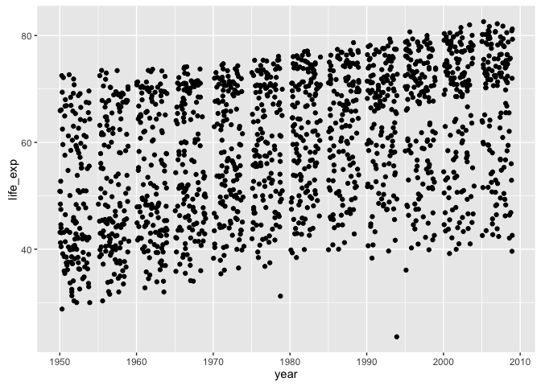
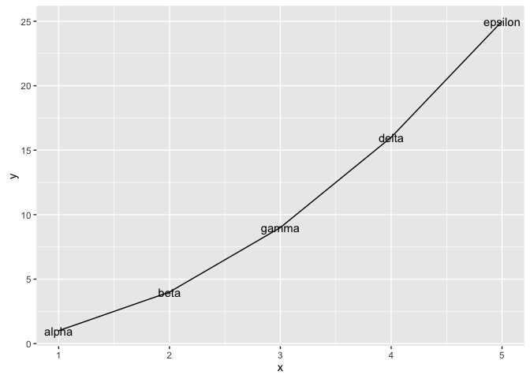
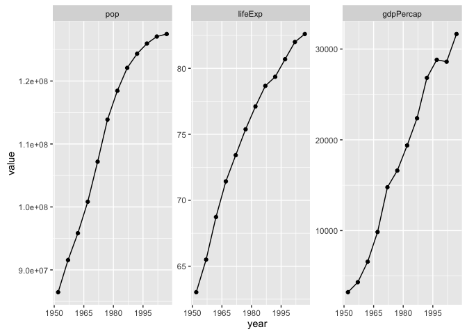

# Secrets of a happy graphing life


### Hidden data wrangling problems

If you are struggling to make a figure, don't assume it's a problem between you and `ggplot2`. Stop and ask yourself which of these rules you are breaking:

  * Keep stuff in data.frames
  * Keep your data.frames *tidy*; be willing to reshape your data often
  * Use factors and be the boss of them
  
In my experience, the vast majority of graphing agony is due to insufficient data wrangling. Tackle your latent data storage and manipulation problems and your graphing problem often melts away.

### Keep stuff in data.frames

I see a fair amount of student code where variables are *copied out* of a data.frame, to exist as stand-alone objects in the workspace.


```r
library(gapminder)
life_exp <- gapminder$lifeExp
year <- gapminder$year
```

Problem is, `ggplot2` has an incredibly strong preference for variables in data.frames; it is virtually a requirement for the main data.frame underpinning a plot.


```r
library(ggplot2)
ggplot(aes(x = year, y = life_exp)) + geom_jitter()
```

```
## Error: ggplot2 doesn't know how to deal with data of class uneval
```

**Just leave the variables in place and pass the associated data.frame!** This advice applies to base and `lattice` graphics as well. It is not specific to `ggplot2`.


```r
ggplot(data = gapminder, aes(x = year, y = life_exp)) + geom_jitter()
```

 

What if we wanted to filter the data by country, continent, or year? This is much easier to do safely if all affected variables live together in a data.frame, not as individual objects that can get "out of sync."

Don't write-off `ggplot2` as a highly opinionated outlier! In fact, keeping data in data.frames and computing and visualizing it *in situ* are widely regarded as best practices. The option to pass a data frame via `data =` is a common feature of many high-use R functions, e.g. `lm()`, `aggregate()`, `plot()`, and `t.test()`, so make this your default *modus operandi*.

#### Explicit data.frame creation via `dplyr::data_frame()`

If your data is already lying around and it's __not__ in a data.frame, ask yourself "why not?". Did you create those variables? Maybe you should have created them in a data.frame in the first place! The new `data_frame()` function in `dplyr` is an improved version of the built-in `data.frame()`, which makes it possible to define one variable in terms of another and that won't mangle your imports via coercion. Specifically, strings will NOT be converted to factors unless you explicitly request that. This removes my most common excuses for data.frame procrastination and avoidance.


```r
suppressPackageStartupMessages(library(dplyr))
my_dat <-
  data_frame(x = 1:5,
             y = x ^ 2,
             text = c("alpha", "beta", "gamma", "delta", "epsilon"))
str(my_dat)
```

```
## Classes 'tbl_df', 'tbl' and 'data.frame':	5 obs. of  3 variables:
##  $ x   : int  1 2 3 4 5
##  $ y   : num  1 4 9 16 25
##  $ text: chr  "alpha" "beta" "gamma" "delta" ...
```

```r
ggplot(my_dat, aes(x, y)) + geom_line() + geom_text(aes(label = text))
```

 

Together with `dplyr::mutate()`, which adds new variables to a data.frame, this gives you the tools to work within data.frames whenever you're handling related variables of the same length.

#### Sidebar: `with()`

Sadly, not all functions offer a `data =` argument. Take `cor()`, for example, which computes correlation. This does __not__ work:


```r
cor(year, lifeExp, data = gapminder)
```

```
## Error in cor(year, lifeExp, data = gapminder): unused argument (data = gapminder)
```

Sure, you can always just repeat the data.frame name like so:

```r
cor(gapminder$year, gapminder$lifeExp)
```

```
## [1] 0.4356112
```

but people hate typing. I suspect subconscious dread of repeatedly typing `gapminder` is what motivates those who copy variables into stand-alone objects in the workspace.

The `with()` function is much better workaround. Provide the data.frame as the first argument. The second argument is an expression that will be evaluated in a special environment. It could be a single command or a multi-line snippet of code. What's special is that you can refer to variables in the data.frame by name.


```r
with(gapminder,
     cor(year, lifeExp))
```

```
## [1] 0.4356112
```

If you use the `magrittr` package, another option is to use the `%$%` operator to expose the variables inside a data.frame for further computation:


```r
library(magrittr)
gapminder %$%
  cor(year, lifeExp)
```

```
## [1] 0.4356112
```

### Tidying and reshaping

*This is an entire topic -- multiple topics, in fact -- covered elsewhere.*

*We covered [`tidyr`](https://cran.r-project.org/web/packages/tidyr/index.html) in [class meeting 012](http://stat545-ubc.github.io/cm012_tidy-data-factors.html).*

*See [the lesson contributed to Data Carpentry](http://stat545-ubc.github.io/bit002_tidying-lotr-data.html) for a worked example of tidying data.*

### Factor management
 
*This is an entire topic, covered elsewhere.*
 
See [Be the boss of your factors](block014_factors.html) to learn how to take charge of factor levels and their order and for how to map old levels into new ones. You'll also see demos of the downstream pay-offs, e.g. more effective figures.

### Worked example

Inspired by this question from a student when we first started using `ggplot2`: How can I focus in on country, Japan for example, and plot all the quantitative variables against year?

Your first instinct might be to filter the Gapminder data for Japan and then loop over the variables, creating separate plots which need to be glued together. And, indeed, this can be done. But in my opinion, the data reshaping route is more "R native" given our current ecosystem, than the loop way.

#### Reshape your data

We filter the Gapminder data and keep only Japan. Then we *gather* up the variables `pop`, `lifeExp`, and `gdpPercap` into a single `value` variable, with a companion variable `key`.


```r
suppressPackageStartupMessages(library(tidyr))
japan_dat <- gapminder %>%
  filter(country == "Japan")
japan_tidy <- japan_dat %>%
  gather(key = var, value = value, pop, lifeExp, gdpPercap)
dim(japan_dat)
```

```
## [1] 12  6
```

```r
dim(japan_tidy)
```

```
## [1] 36  5
```

The filtered `japan_dat` has 12 rows. Since we are gathering or stacking three variables in `japan_tidy`, it makes sense to see three times as many rows, namely 36 in the reshaped result.

#### Iterate over the variables via facetting

Now that we have the data we need in a tidy data.frame, with a proper factor representing the variables we want to "iterate" over, we just have to facet.


```r
p <- ggplot(japan_tidy, aes(x = year, y = value)) +
  facet_wrap(~ var, scales="free_y")
p + geom_point() + geom_line() +
  scale_x_continuous(breaks = seq(1950, 2011, 15))
```

 

#### Recap

Here's the minimal code to produce our Japan example.


```r
japan_tidy <- gapminder %>%
  filter(country == "Japan") %>%
  gather(key = var, value = value, pop, lifeExp, gdpPercap)
ggplot(japan_tidy, aes(x = year, y = value)) +
  facet_wrap(~ var, scales="free_y") +
  geom_point() + geom_line() +
  scale_x_continuous(breaks = seq(1950, 2011, 15))
```

This snippet demonstrates the payoffs from the rules we laid out at the start:

  * We isolate the Japan data into its own __data.frame__.
  * We __reshape__ the data. It's a classic case of __tidying__. We gather three columns into one, because we want to depict them via position along the y-axis in the plot.
  * We use a __factor__ to distinguish the observations that belong in each mini-plot, which then becomes a simple application of facetting.
