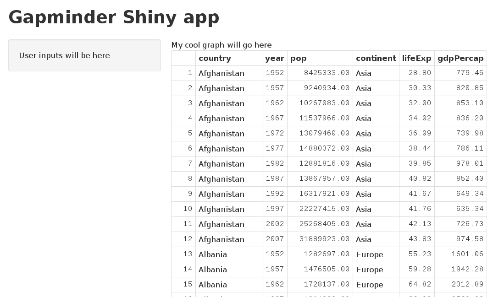
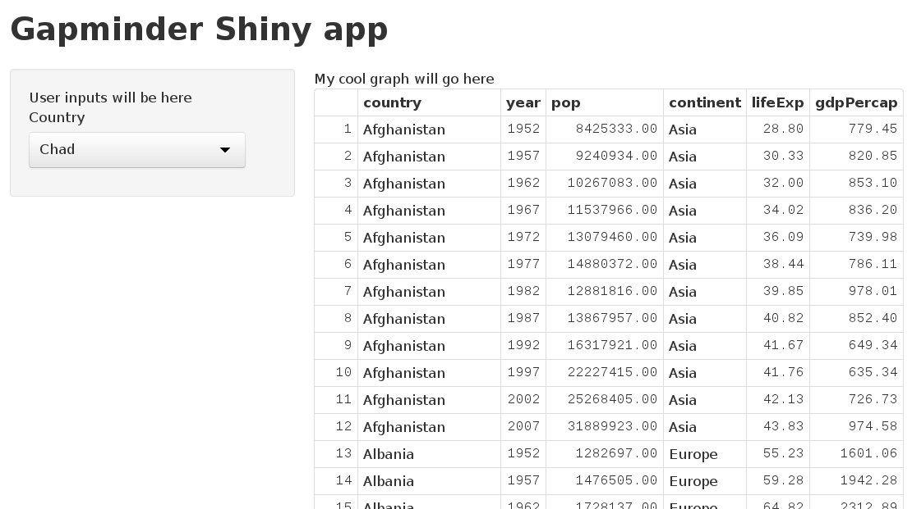
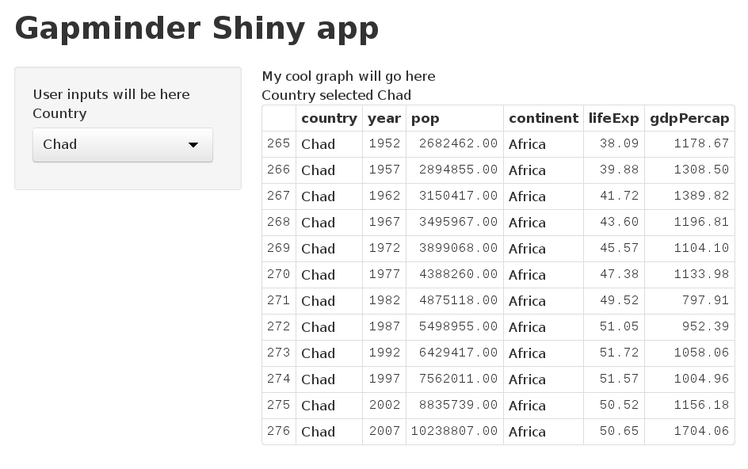
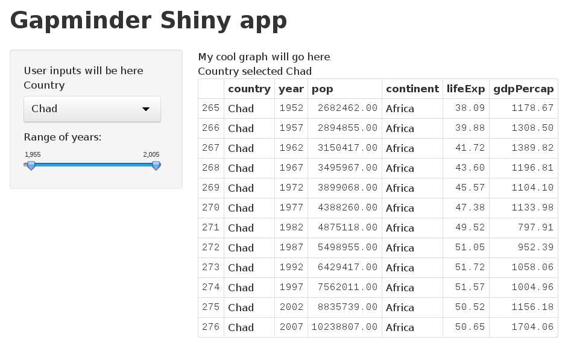
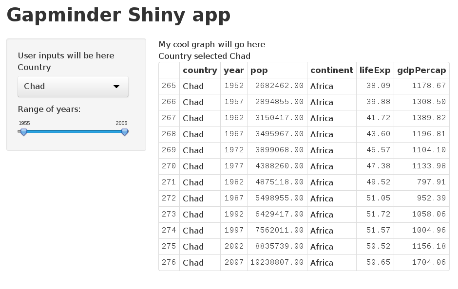
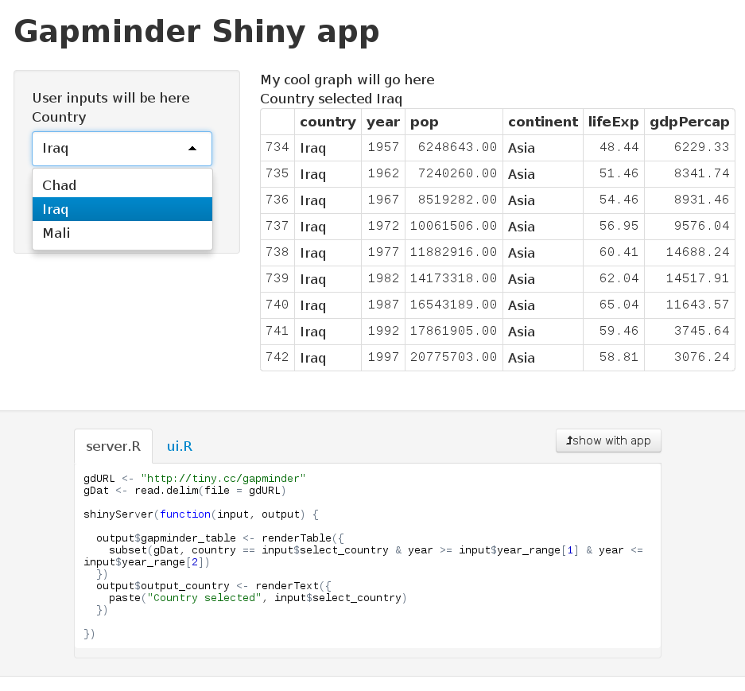
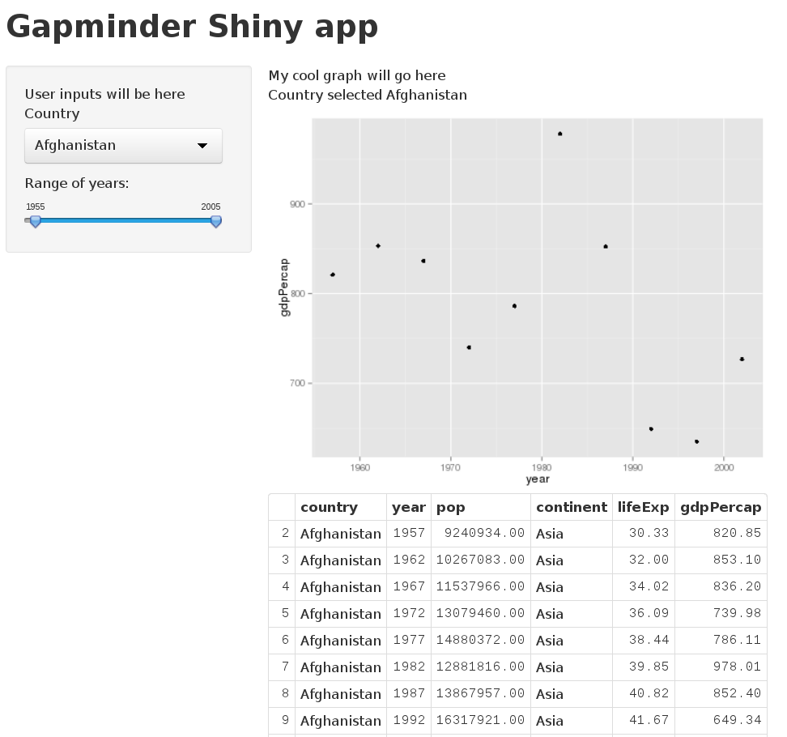
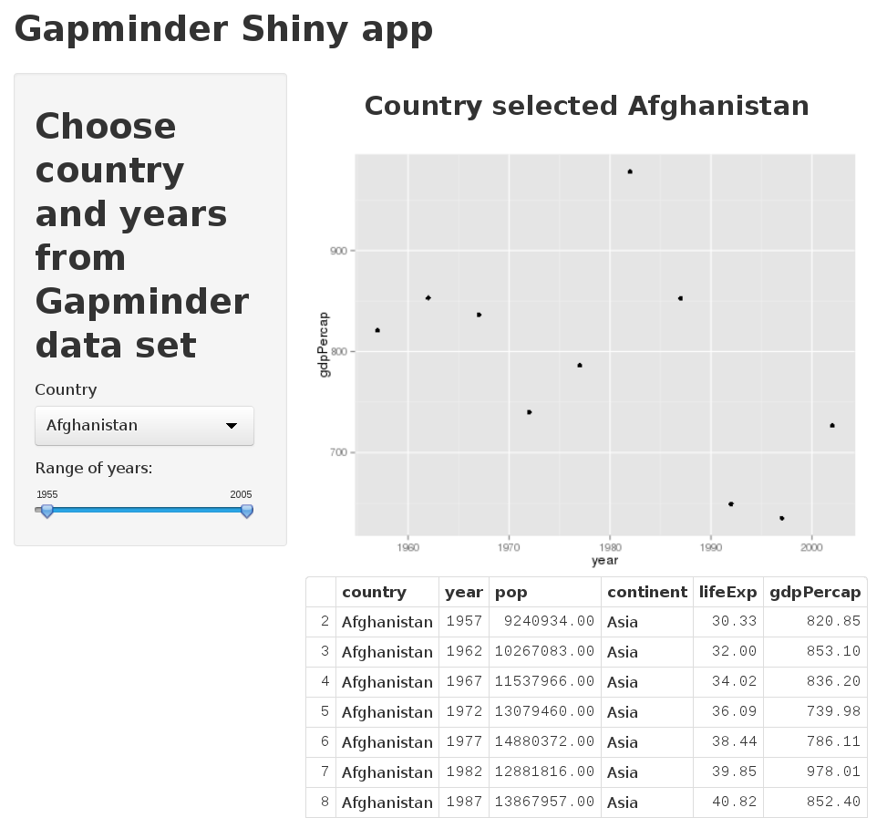

# Stat 545 shiny tutorial using Gapminder data
Julia Gustavsen  
2014-11-17  

# Purpose of this tutorial

* Introduce Shiny
* Write simple Shiny app using GapMinder data

# What is Shiny?

* In a nutshell: an R  package developped by Rstudio that enables you to share interactive graphics (either locally or on the web)
* Simple way to make interactive plots using R
* Uses R to harness power of html, css and javascript for presenting data on the web
* Find more info here: [Shiny: A web application framework for R](http://shiny.rstudio.com/)

## First shiny app

We are going to slowly build our app over the course of this class and the next. Make sure that you have your system set up as described in [Shiny Setup](shiny02_setup.html). You will have 2 files `ui.R` and `server.R`, in addition to the latest Rstudio, `shiny` and `shinyapps` packages. We will start by making a very basic interface using  our `ui.R` script and slowly start adding some bells and whistles to it. 

So the minimum you can have is:

### `ui.R`

```
shinyUI(fluidPage(
))
```

Let's add a bit of text to that:

```
shinyUI(fluidPage(
titlePanel("Gapminder Shiny app")
))
```

### `server.R`

```
shinyServer(function(input, output) {
})
```

There you've created your first shiny app! Well it will be slighly more exciting if we run it!

### Running Shiny apps

You have three different ways that you can run these apps.

1. From your R console prompt. Make sure you have loaded the Shiny package first. Then use the Shiny command `runApp()` with the name of the **directory** that contains your `server.R` and `ui.R` files.

```
library(shiny)  # only needed once per session
runApp("Gapminder-app")
```

2. If either your `server.R` or `ui.R` file is your current script in R studio press "ctr-shift-enter"

3. R studio is smart and recognizes when you are working with files for a Shiny app. If either your `server.R` or `ui.R` file is your current script in R studio you should see a button at the upper right of your source window that says "Run App". You can click on it and your Shiny app will run. ** If this button doesn't appear after the creation of your files, try restarting RStudio. **


With this option you have a lot of control over how the Shiny app is run.


Depending on your Rstudio and shiny set up you should see an empty window open (either in Rstudio or in your default web browser). R will be "listening" until we close the window (if in its own web browser window) or when we click on the stop button to tell it to stop listening for feedback. 

### Adding text elements to the `ui.R`

Let's add to our `ui.R` 

```
shinyUI(fluidPage(
  titlePanel("Gapminder Shiny app"),
  
  sidebarLayout(
    sidebarPanel("User inputs will be here"),
    mainPanel("My cool graph will go here")
  )
))
```
Leaving our `server.R` script the same, let's re-run our app. 

It should look something like this:


Let's go quickly go through a few of these commands:

`titlePanel()` gives our app page a title. 

`sidebarLayout()` is one of the most popular shiny app layouts and the one that we will use today. There are other options for setting up a page such as the gridlayout (just like it sounds), tabsets (where you can switch between web-browser like tabs contained in your app), and a similar navbar (which  is like tabsets, but doesn't look like tabs, rather just other sections to click on in your header). See [Shiny application layout guide](http://shiny.rstudio.com/articles/layout-guide.html) for more details.

`sidebarLayout()` always takes two arguments: `sidebarPanel()` and `mainPanel()`. These are fairly self-explanatory. 


# Loading in data  

Let's start using our data from the gapminder dataset. We will load our data into the `server.R`

```
gdURL <- "http://tiny.cc/gapminder"
gDat <- read.delim(file = gdURL) 

shinyServer(function(input, output) {
})
```

So that reads the data in, but what if we want to show some of the data? First we need to make a variable in `server.R`

```
gdURL <- "http://tiny.cc/gapminder"
gDat <- read.delim(file = gdURL) 

shinyServer(function(input, output) {

  output$gapminder_table <- renderTable({ 
                                       gDat
  })
})
```

The `output$` is the standard in Shiny to use variables on the server side. Here is were we first see one of our `renderX` functions which is responsible managing our data and "serving" it up.  Here we have told the server that we want to have a table in our output.

If we run our app now we can see that nothing has changed, but for anything to appear we have to add it to our ui.R

Let's to our `ui.R` so that we can have a output for our table. 

```
shinyUI(fluidPage(
  titlePanel("Gapminder Shiny app"),
  
  sidebarLayout(
    sidebarPanel("User inputs will be here"
    ),
    mainPanel("My cool graph will go here",
              tableOutput("gapminder_table")
    )
  )
))
```

This is our first instance of using something generated from the `server.R` We use the `output$` variable name to call this in our `ui.R` and it generates a table.  



# Control widgets 

We will start buidling up our plot in a way so that we can choose a country to display when looking at gdp by year. 

## Filtering data by user input

What if we want to filter our table by country? Let's add in a way to filter our data. We can select certain countries. 

## Adding in a select box 

So first we will create a dropdown menu for the countries. 

The way we do this is by adding control widgets, these are different buttons, drop down menus, sliders and other places for users to give input into your app. Today we will work with 2 different widgets: `selectInput` which enables you to choose from a list of options and `sliderInput` which allows you to choose from a range of values along a bar. For more widgets and info on Shiny widgets check out the [Shiny Widget Gallery](http://shiny.rstudio.com/gallery/widget-gallery.html). You can also get help on a specifc widget from its help menu `?sliderInput`.

So to add in these widgets that the user interacts with we will add them to the `ui.R` page the same way that we were adding in text. We will add our control widgets to our sidepanel. 

We need to give our control widgets at least 2 arguments: first a label so that we can access the value from our `server.R` script  (called "inputId") and second a label for the widget in your ui (called "label" in all input functions). If we pull up the help page for `selectInput` we see we have to give an additional argument: choices. Let's add in a dropdown-menu containing three countries into our `ui.R` page.  

```
shinyUI(fluidPage(
  titlePanel("Gapminder Shiny app"),
  
  sidebarLayout(
    sidebarPanel("User inputs will be here",
                 selectInput("select_country", 
                             label = "Country",
                             choices = list("Chad", 
                                            "Iraq", 
                                            "Mali")
                 )
    ),
    mainPanel("My cool graph will go here",
              tableOutput("gapminder_table")
    )
  )
))
```

And when you run your app you should get something that looks like this:



So now we have a way to select one of three countries. 


## Making Shiny react to your inputs

So now let's associate your `ui.R` with something in `server.R`

So you have options on how  you want your shiny app to respond to the user's input. You can deliver an image, a plot, a table, text, or html. 

We will use `renderText` on the `server.R` side to output the text. 

First let's see how to react to this input and then let's see how to use this to change the display in our table. 

We see the text appear when we run our Shiny app. 

Anything that is is `output$` needs to have an associated `render` function. You can `renderImage`, `renderPlot`, `renderPrint`, `renderTable`, `renderText` and `renderUI` (which renders a Shiny tag object or html).

All of these functions take one argument `renderText()` which is R code nested inside `{}`. We want to use our select box to change this input. We will slightly modify `server.R` to reflect this.

```
gdURL <- "http://tiny.cc/gapminder"
gDat <- read.delim(file = gdURL) 

shinyServer(function(input, output) {
  
  output$gapminder_table <- renderTable({ 
    gDat
  })
  output$output_country <- renderText({
    paste("Country selected", input$select_country)
  })
})
```

If we re-run our app we won't see any difference, but let's add a line into our `ui.R` that will let us display our text. You add these outputs to the `ui.R` the same way that you add static text and the control widgets. For now we will start building a way to see the chosen country in the main area. Let's add `textOutput("output_country")` to the `mainPanel()` of `ui.R`.

```
shinyUI(fluidPage(
  titlePanel("Gapminder Shiny app"),
  
  sidebarLayout(
    sidebarPanel("User inputs will be here",
                 selectInput("select_country", 
                             label = "Country",
                             choices = list("Chad", 
                                            "Iraq", 
                                            "Mali")
                 )
    ),
    mainPanel("My cool graph will go here",
              textOutput("output_country"),
              tableOutput("gapminder_table")
    )
  )
))
```

Now when we run our app we see that this text is "reactive", that is it changes when we select a different "country". We have used the `inputId` "select_country" from `ui.R` to give this value to our `server.R` that in turn serves up this value to our `textOutput("output_country")` which shows us our selected country. Neat!

Let's use this to change how we display our table. Let's change what is inside our renderTable be filtered so that it is only our desired country. 

`server.R`

```
gdURL <- "http://tiny.cc/gapminder"
gDat <- read.delim(file = gdURL) 

shinyServer(function(input, output) {
  
  output$gapminder_table <- renderTable({ 
    subset(gDat, country == input$select_country)
  })
  output$output_country <- renderText({
    paste("Country selected", input$select_country)
  })
})
```



Let's add in a way to choose the year. We will use a slider that will let us select the year that we want to start and the end year. We will also put this in the sidebar. 

## Adding in a slider to choose the year

We will add our `sliderInput` control widget to `ui.R`. `sliderInput` requires at least 5 arguments: `inputId` which is the name of the variable when dealing with server.R , `label` this is the text that will be associated with the widget, `min` the lowest value available on the slider, `max` the highest value available on the slider, `value` initial value of the slider. Note that we will have 2 values for the slider so we will pass 2 values for `value` to achieve this. We know that our gapminder data goes from 1952 to 2007, so let's use those values as our min and max. 

```
shinyUI(fluidPage(
  titlePanel("Gapminder Shiny app"),
  
  sidebarLayout(
    sidebarPanel("User inputs will be here",
      selectInput("select_country", 
                  label = "Country",
                  choices = list("Chad", 
                                 "Iraq", 
                                 "Mali")
                  ),
      sliderInput("year_range", 
                  label = "Range of years:",
                  min = 1952, max = 2007, value = c(1955, 2005))
    ),
    mainPanel("My cool graph will go here",
              textOutput("output_country"),
              tableOutput("gapminder_table")              
    )
  )
))
```

When you run your shiny app it should look like this:



The year has a comma after the thousand digit which makes it look less like a year. Let's fix that by adding the `format` argument to `sliderInput`. We will change it to `format = "####"`. 

```
shinyUI(fluidPage(
  titlePanel("Gapminder Shiny app"),
  
  sidebarLayout(
    sidebarPanel("User inputs will be here",
      selectInput("select_country", 
                  label = "Country",
                  choices = list("Chad", 
                                 "Iraq", 
                                 "Mali")
      ),
      sliderInput("year_range", 
                  label = "Range of years:",
                  min = 1952, max = 2007, 
                  value = c(1955, 2005),
                  format = "####")
    ),
    mainPanel("My cool graph will go here",
              textOutput("output_country"),
              tableOutput("gapminder_table")              
    )
  )
))
```

Ahh much better. 



**Exercise**:  Let's change `server.R` so that we can filter our table using this slider too.

`server.R`

```
gdURL <- "http://tiny.cc/gapminder"
gDat <- read.delim(file = gdURL) 

shinyServer(function(input, output) {
  
  output$gapminder_table <- renderTable({ 
    subset(gDat, country == input$select_country & year >= input$year_range[1] & year <= input$year_range[2] )
  })
  output$output_country <- renderText({
    paste("Country selected", input$select_country)
  })
})
```
# Going behind the curtain

## Running Shiny app in "showcase" mode

If you want to see see your scripts and your app together you can run you Shiny app in "showcase made". At your R prompt run:

```
library(shiny)
runApp('Shiny-apps/Gapminder-app', display.mode= "showcase")
```

The app will highlight what is reacting in `server.R` when you select a different country. 



This is a good way to run more complicated apps when you are learning and are curious about how they work. All of the Shiny examples can be run like this. 

## Using `cat`, `str` and `renderPrint()` to learn about your Shiny functions

When we are getting to know Shiny and are learning about what the Shiny functions are returning we would like to be able to use `str` (look at the structure) to learn about about an object or to use `cat` to see what the output of an object is. 

These functions can be put in `server.R` in any of your reactive functions and will print to the console. 

So we could try:

```
gdURL <- "http://tiny.cc/gapminder"
gDat <- read.delim(file = gdURL) 

shinyServer(function(input, output) {
  
  output$gapminder_table <- renderTable({ 
    str(input$select_country)
    subset(gDat, country == input$select_country & year >= input$year_range[1] & year <= input$year_range[2])
  })
  output$output_country <- renderText({
    paste("Country selected", input$select_country)
  })
})
```

And we see that when we run the Shiny app we get an output to the console: "chr "Chad"". This output changes each time that we select a different country from our select box. We could replace `str(input$select_country)` with `cat(input$select_country)` and see our expected output at the console. 

If we wanted to show this sort of output in our Shiny app we could add another output$ variable to our `server.R`.

```
gdURL <- "http://tiny.cc/gapminder"
gDat <- read.delim(file = gdURL) 

shinyServer(function(input, output) {
  
  output$gapminder_table <- renderTable({ 
    subset(gDat, country == input$select_country & year >= input$year_range[1] & year <= input$year_range[2])
  })
  output$output_country <- renderText({
    paste("Country selected", input$select_country)
  })
  output$info <- renderText({
    str(input$select_country)
  })
})
```

To see any output we have to add to our `ui.R` :

```
shinyUI(fluidPage(
  titlePanel("Gapminder Shiny app"),
  
  sidebarLayout(
    sidebarPanel("User inputs will be here",
                 selectInput("select_country", 
                             label = "Country",
                             choices = list("Chad", 
                                            "Iraq", 
                                            "Mali")
                 ),
                 sliderInput("year_range", 
                             label = "Range of years:",
                             min = 1952, max = 2007, 
                             value = c(1955, 2005),
                             format = "####")
    ),
    mainPanel("My cool graph will go here",
              textOutput("output_country"),
              tableOutput("gapminder_table"),
              textOutput("info")
    )
  )
))
```

But when we run this we don't get any output in the app, but we still see the `str` output to the console.

To get this type of output in our console we need to change our `renderText()` function to the `renderPrint()` to return what would be printed to the console. 

So if we replace that part of `server.R`: 

```
gdURL <- "http://tiny.cc/gapminder"
gDat <- read.delim(file = gdURL) 

shinyServer(function(input, output) {
  
  output$gapminder_table <- renderTable({ 
    subset(gDat, country == input$select_country & year >= input$year_range[1] & year <= input$year_range[2])
  })
  output$output_country <- renderText({
    paste("Country selected", input$select_country)
  })
  output$info <- renderPrint({
    str(input$select_country)
  })
})
```
We will see the expected behaviour when we run our app. 

# Finally, making a reactive plot 

We will load in the ggplot2 package since we will use that for our plot. If we had some helper functions or something else we wanted to use here we could also add in a line `source("useful_functions.R")`.   

## Generate plot from data 

Now that we've laid our beautiful foundation, we are ready to build our plot! So now that we have everything organized we just add our ggplot call to the `server.R` and tell `ui.R` to show our plot. Let's go:

To add a plot we do it in the same way that we add text by using our family of `renderX` calls. This time we will use `renderPlot`. We will use our selected country from the dropdown menu to subset our data set and then we will graph the gross domestic product per capita by year for our selected country. 

We will simply add the plot and for now use our `subset` function again to use our data selected by the user. 

`server.R` :

```
library(ggplot2)
gdURL <- "http://tiny.cc/gapminder"
gDat <- read.delim(file = gdURL) 

shinyServer(function(input, output) {
  
  output$gapminder_table <- renderTable({ 
    subset(gDat, country == input$select_country & year >= input$year_range[1] & year <= input$year_range[2] )
  })
  output$output_country <- renderText({
    paste("Country selected", input$select_country)
  })
  output$ggplot_gdppc_vs_country <- renderPlot({
    p <-  ggplot(subset(gDat, country == input$select_country & year >= input$year_range[1] & year <= input$year_range[2]), aes(x = year, y = gdpPercap))
    p + geom_point()
  })
})
```

Then the only thing left to do is to is to add the plot to `ui.R`. We do this in the same way that we added the text. We add `plotOutput("ggplot_gdppc_vs_country")`. Tada! You can try plotting different countries and different years. 

But we see that we have some repetition in our plot and since we want to keep nice clean code that we can easily maintain we should get rid of this. Let's get rid of the redundancy by moving the subsetting of the data out of the plot and table render functions. We'll start by adding an assignment that will create a copy of our data based on our `ui.R` inputs. 

```
library(ggplot2)
gdURL <- "http://tiny.cc/gapminder"
gDat <- read.delim(file = gdURL) 

shinyServer(function(input, output) {
  
  one_country_data  <- subset(gDat, country == input$select_country & year >= input$year_range[1] & year <= input$year_range[2])
  
  output$gapminder_table <- renderTable({ 
    subset(gDat, country == input$select_country & year >= input$year_range[1] & year <= input$year_range[2] )
  })
  output$output_country <- renderText({
    paste("Country selected", input$select_country)
  })
  output$ggplot_gdppc_vs_country <- renderPlot({
    p <-  ggplot(subset(gDat, country == input$select_country & year >= input$year_range[1] & year <= input$year_range[2]), aes(x = year, y = gdpPercap))
    p + geom_point()
  })
})
```

Eeeep when we go to run our app we get no table or plot. We get an error that starts: "Error in .getReactiveEnvironment()$currentContext()". This is because we've tried to use "reactive" input without a `renderX()` function. Shiny is not happy about this.

We can work around this by using a function called `reactive`.

`server.R` with added plot and `reactive()` data. 

```
library(ggplot2)
gdURL <- "http://tiny.cc/gapminder"
gDat <- read.delim(file = gdURL) 

shinyServer(function(input, output) {
  
  one_country_data  <- reactive({
    subset(gDat, country == input$select_country & year >= input$year_range[1] & year <= input$year_range[2] )
  })
  output$gapminder_table <- renderTable({ 
    one_country_data()
  })
  output$output_country <- renderText({
    paste("Country selected", input$select_country)
  })
  output$ggplot_gdppc_vs_country <- renderPlot({
    p <-  ggplot(subset(gDat, country == input$select_country), aes(x = year, y = gdpPercap))
    p + geom_point() + xlim(c(input$year_range[1], input$year_range[2]))
  })
})
```

Let's run that.

Ok it works. Let's use this in our plot too:

```
gdURL <- "http://tiny.cc/gapminder"
gDat <- read.delim(file = gdURL) 

shinyServer(function(input, output) {
  
  one_country_data  <- reactive({
    subset(gDat, country == input$select_country & year >= input$year_range[1] & year <= input$year_range[2] )
  })
  
  output$gapminder_table <- renderTable({ 
    one_country_data()
    })
  output$output_country <- renderText({
    paste("Country selected", input$select_country)
  })
  output$ggplot_gdppc_vs_country <- renderPlot({
    p <-  ggplot(one_country_data(), aes(x = year, y = gdpPercap))
    p + geom_point() 
  })
})
```

## Using our app with more than 3 countries

Earlier in our app we used the `selectInput` widget to get info from the user about "countries". Many Shiny apps use this sort of input where the options you select are coded into the `ui.R`, however since you are bffs with the Gapminder data and you demand sophistication in your data exploration we will look at an alternative to populating a `selectInput(..., choices = list())` with all 142 countries that are found in the gapminder dataset without typing them all in. 

So what we need to do is to generate a dynamic select list from the server side. We are going to use a new `renderX` function called `renderUI`. It works like the text and plot rendering output called, but will output a **u**ser **i**nterface.

To use this function we will first put a render call in `server.R` 

```
  # Drop-down selection box generated from Gapminder dataset
  output$choose_country <- renderUI({
    selectInput("country_from_gapminder", "Country", as.list(levels(gDat$country)))
  })
```

To get this to display in our app let's add a call to this output in our panel where we let the user choose the year and country. We add a simple call to `uiOutput("choose_country")` in `ui.R` in our sidepanel.  

```
shinyUI(fluidPage(
  titlePanel("Gapminder Shiny app"),
  
  sidebarLayout(
    sidebarPanel("User inputs will be here",
      uiOutput("choose_country"),
      selectInput("select_country", 
                  label = "Country",
                  choices = list("Chad", 
                                 "Iraq", 
                                 "Mali")
      ),
      sliderInput("year_range", 
                  label = "Range of years:",
                  min = 1952, max = 2007, 
                  value = c(1955, 2005),
                  format = "####")
    ),
    mainPanel("My cool graph will go here",
              textOutput("output_country"),
              plotOutput("ggplot_gdppc_vs_country"),
              tableOutput("gapminder_table")
              
    )
  )
))
```

We run the app and see that we have a select box that populates from all of the countries in Gapminder. But now we have a confusing app that still only reacts to our three country drop-down menu. 

Let's tidy up our app a bit and get rid of the old select box, change the select panel box to something more informative, get rid of our silly first sentence "my cool graph will go here", and change the text output for country to something that reflects our new select box (even though it is on the server.R side we see that idvariable name is called the same way as if it were on the `ui.R` page).

So now our `server.R` script looks like this:

```
library(ggplot2)
gdURL <- "http://tiny.cc/gapminder"
gDat <- read.delim(file = gdURL) 

shinyServer(function(input, output) {

  # Drop-down selection box generated from Gapminder dataset
  output$choose_country <- renderUI({
    selectInput("country_from_gapminder", "Country", as.list(levels(gDat$country)))
  })
  one_country_data  <- reactive({
    subset(gDat, country == input$country_from_gapminder & year >= input$year_range[1] & year <= input$year_range[2] )
  })
   output$gapminder_table <- renderTable({ 
    one_country_data()
    })
  output$output_country <- renderText({
    paste("Country selected", input$country_from_gapminder)
  })
  output$ggplot_gdppc_vs_country <- renderPlot({
    p <-  ggplot(one_country_data(), aes(x = year, y = gdpPercap))
    p + geom_point() 
  })
})
```

Our `ui.R` script looks like this:

```
shinyUI(fluidPage(
  titlePanel("Gapminder Shiny app"),
  
  sidebarLayout(
    sidebarPanel("User inputs will be here",
                 uiOutput("choose_country"),
                 sliderInput("year_range", 
                             label = "Range of years:",
                             min = 1952, max = 2007, 
                             value = c(1955, 2005),
                             format = "####")
    ),
    mainPanel("My cool graph will go here",
              textOutput("output_country"),
              plotOutput("ggplot_gdppc_vs_country"),
              tableOutput("gapminder_table")              
    )
  )
))
```

And our app looks like this:



### Warning: "Warning in is.na(e2)"

You might have noticed that our app produces some warnings (angry red text in console) when we first run our shiny app now. This is happening because we are trying to get data from the renderUI text box, but it hasn't generated the text box yet. Afer the drop-down menu has been generated from `server.R` the app is able to find all of the data that it needs. If you want to avoid this issue you can add some code to deal with these initial states. 

In our one_country_data reactive function we add: 
```
  if(is.null(input$country_from_gapminder)) {
      return(NULL)
    }
```
And to the output$ggplot_gdppc_vs_country renderPlot we add:

```
    if(is.null(one_country_data())) {
      return(NULL)
    }
```

So now our `server.R` looks like this:

`server.R`
```
library(ggplot2)
gdURL <- "http://tiny.cc/gapminder"
gDat <- read.delim(file = gdURL) 

shinyServer(function(input, output) {
  
  # Drop-down selection box generated from Gapminder dataset
  output$choose_country <- renderUI({
    selectInput("country_from_gapminder", "Country", as.list(levels(gDat$country)))
  })
  
  one_country_data <- reactive({
    if(is.null(input$country_from_gapminder)) {
      return(NULL)
    }
    subset(gDat, country == input$country_from_gapminder &
             year >= input$year_range[1] & year <= input$year_range[2] )
  })
    
  output$gapminder_table <- renderTable({ 
    one_country_data()
  })
  output$output_country <- renderText({
    if (is.null(input$country_from_gapminder)){
      return(NULL)
    }
    paste("Country selected", input$country_from_gapminder)
  })
  output$ggplot_gdppc_vs_country <- renderPlot({
    if(is.null(one_country_data())) {
      return(NULL)
    }
    p <-  ggplot(one_country_data(), aes(x = year, y = gdpPercap))
    p + geom_point() 
  })
})
```


# Adding headers and html gadgets to Shiny App

We can add some different header styles to our `ui.R` app if we want. 

We can change our `ui.R` to have the sidebar title to have a bigger header by using some tags (many of which come from html. If you know html,great, if not, no worries). Let's change our sidebarPanel text to have the formatting of Header 2 (You can have headers 1 to 6 with 1 being to biggest and 6 being the smallest). To do that we wrap the text in `h2()`.

```
shinyUI(fluidPage(
  titlePanel("Gapminder Shiny app"),
  
  sidebarLayout(
    sidebarPanel(
    h2("What country and years do you want to see?"),
      uiOutput("choose_country"),
      sliderInput("year_range", 
                  label = "Range of years:",
                  min = 1952, max = 2007, 
                  value = c(1955, 2005),
                  format = "####")
    ),
    mainPanel("My cool graph will go here",
              textOutput("output_country"),
              plotOutput("ggplot_gdppc_vs_country"),
              tableOutput("gapminder_table")              
    )
  )
))
```
Let's get rid of our boring placeholder text and try wrapping our `textOutput()` in a header tag. 

```
shinyUI(fluidPage(
  titlePanel("Gapminder Shiny app"),
  
  sidebarLayout(
    sidebarPanel(
      h2("Choose country and years from Gapminder data set"),
      uiOutput("choose_country"),
      sliderInput("year_range", 
                  label = "Range of years:",
                  min = 1952, max = 2007, 
                  value = c(1955, 2005),
                  format = "####")
    ),
    mainPanel(h3(textOutput("output_country")),
              plotOutput("ggplot_gdppc_vs_country"),
              tableOutput("gapminder_table")              
    )
  )
))
```


Like many things in R we can play around with this and take pains to make it beautiful, but today we will just show you one more of these tricks. We can center align the text:

```
shinyUI(fluidPage(
  titlePanel("Gapminder Shiny app"),
  
  sidebarLayout(
    sidebarPanel(
      h2("Choose country and years from Gapminder data set"),
      uiOutput("choose_country"),
      sliderInput("year_range", 
                  label = "Range of years:",
                  min = 1952, max = 2007, 
                  value = c(1955, 2005),
                  format = "####")
    ),
    mainPanel(h3(textOutput("output_country"), align = "center"),
              plotOutput("ggplot_gdppc_vs_country"),
              tableOutput("gapminder_table")              
    )
  )
))
```



There are many other tags you can use to format your text in Shiny such as `p()` to make paragraphs, and `code()` to display text like code. You can make ordered and unordered lists too, but these will require you to add  "tags" to the function wrapper `tags$ul()` (unordered list item). You can list all tags by running `names(tags)`. You can get further information on these in the [Shiny html tags glossary](http://shiny.rstudio.com/articles/tag-glossary.html).

# Execution

* server.R is run once, 
* code inside `shinyServer()` is run everytime you visit the app so you can use this space to make data for each user. 
* Anything in a `renderX()` is rerun whenever it is changed. This will influence where you put your code to determine what is run just once or what is run everytime the app refreshes. 

* However if you want to change it so that your app does not change right away you can add a "submit" button which is a way to only render the app once it is clicked. `submitButton(text = "Apply Changes")`. Add this to our `ui.R` and no plot appears until we click on the button. 

# Deployment

So you are ready to show you app to the world. What are your options?

## Stat UBC Shiny Pro server

* some students will use Jenny's server
* volunteers? Jenny will update

## Run apps from public GitHub repositories.

* `runGitHub()` is a way to run an app from github using Rstudio. 
* to use this push your server.R and ui.R files to a public github repo (in their own folder, remember Shiny is particular). `runGitHub()` takes a few arguments, if I had a public repo in the Stat545 organization called "julia_gustavsen_shiny" and I had pushed my Gapminder app `server.R` and `ui.R` (and any other necessary files) to that repo, we could run my app using `runGitHub("STAT545-UBC/julia_gustavsen_shiny",subdir = "Shiny-apps/Gapminder-app/"). The subdirectory argument refers to the subdirectory in the repository. 

## Deploy your app to www.shinyapps.io and send url to users

* From either your `server.R` or `ui.R` app click on the "Publish" button

* This will ensure you have the `shinyapps` package and take youto (http://shinyapps.io). Follow the directions from the website  to set up your account. See our setup directions if there are any hiccups during this process: [Deploy your app](shiny02_setup.html)
